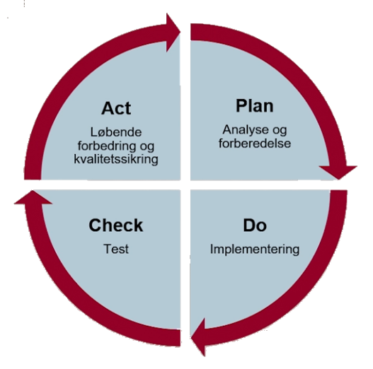

# Beredskabsstyring

Beredskabsstyring handler om at sikre, at en virksomhed kan fortsætte sin drift, selv når uforudsete hændelser opstår. Det kan være alt fra cyberangreb til brand eller tekniske nedbrud.  

En vigtig del af beredskabsstyring er at have alternative processer, der kan bruges ved systemnedbrud. Det handler også om at vurdere, hvor hurtigt systemer og data kan gendannes.  

For at udarbejde en effektiv beredskabsplan er det nødvendigt at forstå forretningen.  
- Hvilke funktioner er kritiske, og hvilke kan undværes i en krisesituation?  
- Hvor længe kan systemer være nede, før det påvirker driften uacceptabelt?  
- Hvor meget data kan virksomheden tåle at miste?  

Ledelsen spiller en nøglerolle i beredskabsstyringen. Det er deres ansvar at allokere ressourcer og træffe beslutninger, der sikrer et effektivt beredskab. Hvis virksomheden behandler persondata, er der lovkrav om beredskabsstyring, blandt andet i GDPR.  

### Lovgivning og standarder  

GDPR indeholder specifikke krav til beredskabsstyring, særligt i artikel 32, 33 og 34. Der stilles krav om, at en virksomhed hurtigt skal kunne gendanne tilgængeligheden og adgangen til personoplysninger i tilfælde af en hændelse. Desuden skal datalæk rapporteres inden for 72 timer.  

ISO 27001 er en international standard for informationssikkerhed, hvor beredskabsstyring er en central del under Anneks A, foranstaltning 5.24 til 5.30.  

Virksomheder underlagt NIS2-direktivet skal leve op til skærpede krav om beredskabsstyring. Artikel 21, stk. 2, litra c stiller krav om, at virksomheder har en plan for, hvordan driften opretholdes under en hændelse.  

Artikel 23 i NIS2 fastsætter krav til hændelsesrapportering.  
- Væsentlige hændelser skal rapporteres til CSIRT uden unødigt ophold, inden for 24 timer.  
- En hændelsesrapport skal være klar inden for 72 timer.  
- En detaljeret rapport med hændelsens indvirkning og de trufne foranstaltninger skal afleveres inden for en måned.  

### Beredskabsplanens faser  

Ifølge Anneks A, 5.30 skal en virksomheds IKT-parathed planlægges, implementeres, vedligeholdes og testes baseret på krav til business continuity.  

#### Planlægning (Plan)  
I denne fase udarbejdes beredskabsplanen.  
- Hvilke scenarier kan opstå, og hvordan håndteres de?  
- Overblik over organisationens risici baseret på risikovurderinger og business impact analysis (BIA).  
- Fastlæggelse af ansvar, herunder eksterne og interne aktører.  
- Kriterier for indkaldelse af beredskabsgruppen.  

#### Implementering (Do)  
Planen bliver omsat til handling gennem træning, procedurer og kommunikation.  
- Sikring af, at ansatte kender planen og deres roller.  
- Definition af mødesteder og kommunikationsmetoder.  
- Klarhed over ressourcer og ansvarsfordeling.  

#### Afprøvning (Check)  
Planen testes gennem øvelser for at sikre, at procedurer fungerer efter hensigten.  
- Test af, om kommunikation og beslutningsprocesser fungerer i praksis.  
- Identifikation af forbedringsmuligheder.  

#### Evaluering (Act)  
Efter hver test eller reel hændelse evalueres, hvad der gik godt, og hvad der kan forbedres.  
- Justering af planen baseret på nye erfaringer.  
- Opdatering af ansvarsfordeling, processer og risikovurderinger.  
- Tilpasning af beredskabsplanen til nye behov, fx ved ændringer i organisationen.  

Disse fire faser udgør en cyklus, der skal gentages løbende for at sikre, at beredskabet er opdateret og effektivt.  

### Beredskabsøvelser  

Beredskabsøvelser er afgørende for at teste, om planer fungerer i praksis. En plan, der ikke testes, er kun teori.  

Det er vigtigt at afprøve beredskabet løbende for at sikre, at procedurer fungerer efter hensigten.  

#### Skrivebordsøvelser  
Teoretiske gennemgange af scenarier, hvor man diskuterer, hvad man gør i en given situation.  
- Er telefonlister opdaterede?  
- Hvem har hvilke roller?  
- Hvordan aktiveres beredskabet?  

#### Scenarietests  
Mere realistiske simuleringer, hvor man afprøver, hvordan organisationen reagerer på en hændelse.  
- Simulering af ransomware-angreb eller DDoS-angreb.  
- Test af, om beredskabslederen kan lede, og om log-ansvarlige kan dokumentere hændelser korrekt.  

#### Kriseøvelser  
Udførlig simulering af en hændelse, hvor alle roller deltager i en praktisk test af beredskabet.  

### It-beredskabsroller  

Sikkerdigital har udviklet et beredskabsspil, der kan bruges til at øve krisestyring. Digitaliseringsstyrelsen anbefaler en klar rollefordeling i it-beredskabet.  

Typiske roller inkluderer:  
- It-beredskabsledelsen: Øverste beslutningsorgan, der håndterer væsentlige beslutninger.  
- It-beredskabskoordinator: Bistår ledelsen i koordinering af it-beredskabsaktiviteter.  
- Kommunikationsansvarlig: Sikrer korrekt kommunikation med interne og eksterne parter.  
- Reetableringsansvarlig: Sikrer genoprettelse af normal drift.  
- It-beredskabssekretær: Føring af log over alle beslutninger og aktiviteter.  

En beredskabsøvelse bør aldrig anses som afsluttet, før der er blevet foretaget en evaluering.  

### Status på beredskabsstyring i Danmark  

I forbindelse med den nationale cyberberedskabsøvelse "Hele Danmark Øver" viste en undersøgelse fra TDC Erhverv, at:  
- Kun 20 procent af danske virksomheder har en beredskabsplan for cyberangreb.  
- 33 procent har ingen cyberforsikring.  
- 60 procent af små og mellemstore virksomheder risikerer konkurs efter et cyberangreb.  
- 39 procent af deltagerne i øvelsen har tidligere været udsat for et cyberangreb.  

### Konklusion  

Beredskabsstyring handler om at være forberedt på det uforudsete.  

Ved at have en solid beredskabsplan og træne den regelmæssigt, kan virksomheder reducere konsekvenserne af cyberangreb og andre kritiske hændelser. Beredskabsstyring spiller tæt sammen med risikohåndtering og øger det generelle niveau af informationssikkerhed.  

Planer skal løbende evalueres og justeres. En fast proces for test og forbedring bør indgå i et årshjul, så arbejdet med beredskab bliver en integreret del af organisationens sikkerhedsstrategi.  

Kun gennem øvelser finder man ud af, hvad der virker, og måske vigtigere – hvad der ikke virker.  
