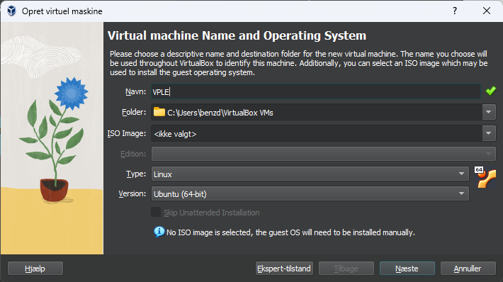
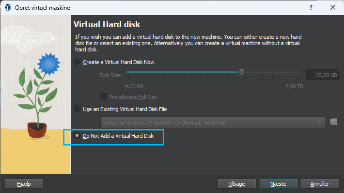
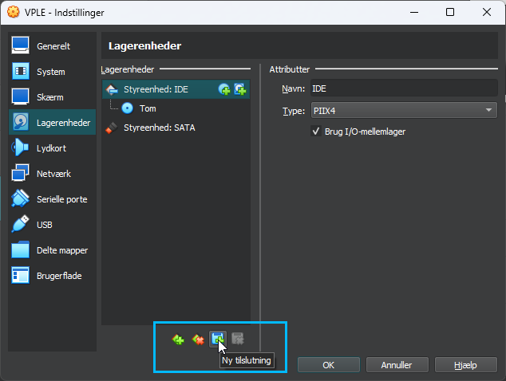
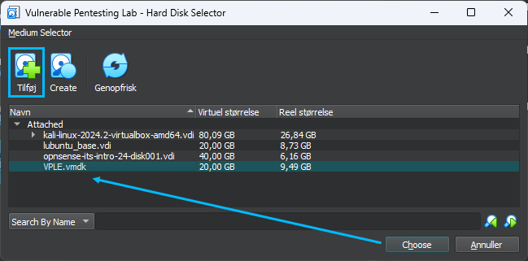
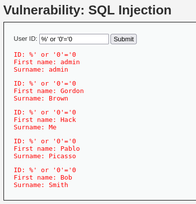
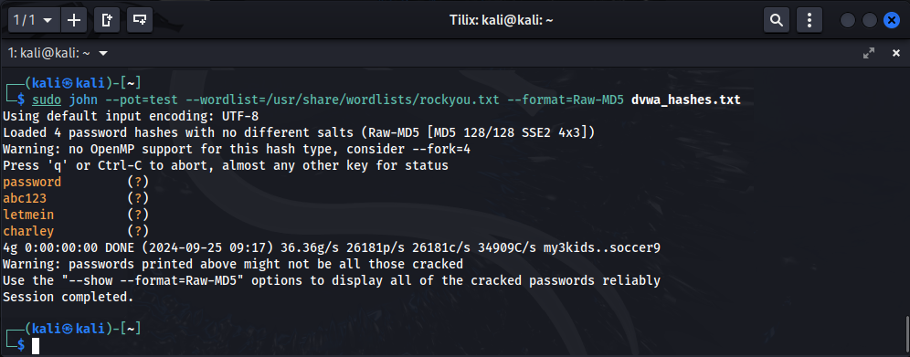

# Uge 39 - Netværksanalyse

### [Øvelse 23 - Vulnerable Pentesting Lab Environment](https://ucl-pba-its.gitlab.io/24e-its-intro/exercises/23_intro_opgave_vmware_dvwa/)

Guiden i øvelsen gav en del problemer. Herunder er forklaret hvordan jeg fik installeret VPLE i Virtualbox.

1. Hent VPLE VM'en. [VPLE Download](https://www.vulnhub.com/entry/vulnerable-pentesting-lab-environment-1,737/)
2. Udpakningen fejler med standard windows "udpak alle". Udpak filerne med 7-zip eller lignende.
3. De udpakkede filer passer ikke umiddelbart til VirtualBox. På hjemmesiden står der også at maskinen er til VMWare.
4. I Virtualbox. Opret en ny maskine, uden at tilknytte en ISO fil.  
   

5. Tildel ressourcer, men tilføj ikke nogen harddisk. Vælg "Do not Add a Virtual Hard Disk"  
   
 
6. Efter oprettelsen, gå til maskinens indstillinger og vælg "Lagerenheder". Tryk på knappen "Ny Tilslutning" --> "Harddisk".  
   

7. Tryk Tilføj, og vælg den før udpakkede .vmdk fil.   
   

8. Nu kan maskinen startes og guiden fra [Ugeplanen](https://ucl-pba-its.gitlab.io/24e-its-intro/exercises/23_intro_opgave_vmware_dvwa/#information) kan følges fra punkt 4.

**username: administrator**  
**password: password** 

Mit netværksinterface hed enp0s3 og ikke ens33  
[how-to-configure-static-ip-address-on-ubuntu](https://linuxize.com/post/how-to-configure-static-ip-address-on-ubuntu-20-04/)

```yaml
network:
  version: 2
  renderer: networkd
  ethernets:
    enp0s3:
      dhcp4: no
      addresses:
        - 10.10.3.10/24
      gateway4: 10.10.3.1
```

---

### [DVWA Challenge 07: SQL Injection](https://github.com/keewenaw/dvwa-guide-2019/blob/master/low/Challenge%2007%3A%20SQL%20Injection.md)

Objective: 
There are 5 users in the database, with IDs from 1 to 5. Steal their passwords via SQLi.

På siden http://10.10.3.10:1335/vulnerabilities/sqli/ er det muligt at slå de 5 brugere op med ID. Forsøger man et ID over 5, returnerer serveren ikke noget.  
I guiden forsøger han at submitte karakteren `'`.  
Det giver en fejlmeddelelse der fortæller at den bagvedliggende database er af typen MariaDB.

I guiden oplyses det at man i dokumentationen for MariaDB angiver karakteren `%`som wildcard.  
Det giver ikke noget svar, så han ændrer forespørgslen til `%' or '0'='0`. Det gør han ud fra logikken at forespørgslen altid vil være "True" og dermed returnere et output.



Han ændrer så forespørgslen til `%' or '0'='0' union select * from password #`  
"Union" funktionen i SQL bruges til at kombinere resultaterne af to eller flere SELECT-forespørgsler.

!!! abstract "ChatGPT forklarer"

    UNION-funktionen i SQL bruges til at kombinere resultaterne af to eller flere SELECT-forespørgsler i én samlet resultatliste. UNION fjerner automatisk dubletter fra resultatet, medmindre du specifikt bruger UNION ALL, som inkluderer alle rækker, inklusive dubletter.

    **Grundlæggende regler for brug af UNION:**  
    1. Kolonneantallet skal være ens: De SELECT-forespørgsler, der kombineres, skal have samme antal kolonner.  
    2. Datatyper skal matche: Kolonnerne, der kombineres, skal have kompatible datatyper, så resultaterne kan flettes korrekt.  
    3. Kolonnernes rækkefølge betyder noget: Data kombineres i rækkefølge fra venstre mod højre.

    ```sql
    SELECT name, age FROM employees
    UNION
    SELECT name, age FROM customers;
    ```
    I dette eksempel kombineres navn og alder fra to tabeller (employees og customers). Resultatet viser en liste over unikke name og age fra begge tabeller.  

    **Brug af "UNION ALL"**  
    Hvis du vil inkludere dubletter, kan du bruge UNION ALL:
    
    ```sql
    SELECT name, age FROM employees
    UNION ALL
    SELECT name, age FROM customers;
    ```
    Her vil alle resultater fra begge forespørgsler blive vist, inklusive dubletter.

Mit kendskab og interesse indenfor SQL rækker desværre ikke til mere, og resten af øvelsen vil være at jeg indtaster ting fra guiden som jeg ikke ved hvad betyder. Jeg springer derfor nogle led over og går direkte til løsningen.

Med SQL-kommandoen `%' or '0'='0' union select user, password from dvwa.users #`lykkedes det at få brugernes brugernavne og password hash returneret fra databasen:

| Fornavn / Efternavn     | Brugernavn | Password Hash                    |
| ----------------------- | ---------- | -------------------------------- |
| Admin Admin             | admin      | 5f4dcc3b5aa765d61d8327deb882cf99 |
| Gordon Brown            | gordonb    | e99a18c428cb38d5f260853678922e03 |
| Hack Me                 | 1337       | 8d3533d75ae2c3966d7e0d4fcc69216b |
| Pablo Picasso           | pablo      | 0d107d09f5bbe40cade3de5c71e9e9b7 |
| Bob Smith               | smithy     | 5f4dcc3b5aa765d61d8327deb882cf99 |

Nu gælder det om at få cracket disse MD5 hashes, så vi kan få adgang til nogen passwords.

Til det bruger jeg programmet "John" i Kali Linux, sammen med wordlisten rockyou.txt. og en fil indeholdene de førnævnte hashes:    
```bash
sudo john --wordlist=/usr/share/wordlists/rockyou.txt --format=Raw-MD5 dvwa_hashes.txt 
```


Outputtet viser fire passwords, da to af brugerne deler passwordet "password".

---

### [DVWA Challenge 04: File Inclusion](https://github.com/keewenaw/dvwa-guide-2019/blob/master/low/Challenge%2004:%20File%20Inclusion.md)

Objective: 
Read all five famous quotes from ../hackable/flags/fi.php using only file inclusion.

På siden http://10.10.3.10:1335/vulnerabilities/brute/ er der tre filer tilgængelige. Når man klikke på dem kan man se at URL'en ændrer sig:  
page=file1.php, page=file2.php og page=file3.php

Næste skridt er at forsøge at manipulerer URL'en til at åbne Google.com "inde i" siden.  
`http://10.10.3.10:1335//vulnerabilities/fi/?page=https://www.google.com`

Mod forventning, åbner google ikke på siden, og jeg opdager en fejlmeddelelse øverst på startsiden for opgaven.


Jeg undersøger hvad det betyder og finder frem til en løsning via dette [link.](https://akshaygupta21.medium.com/how-to-setup-dvwa-in-kali-linux-e7c0dc272bba)

Det er en indstilling der skal ændres i Kali. Åbn følgende fil:
```bash
sudo nano /etc/php/8.2/apache2/php.ini
```
Brug søgefunktionen for at finde "allow_url_include" i filen. Ændrer linjen til følgende:
`allow_url_iclude = On`

Genstart apache serveren med kommandoen:
```bash
sudo systemctl restart apache2
```

Ovenstående virkede ikke som jeg havde forventet. Efter at have søgt og afprøvet andre løsninger, fandt jeg dette [link](https://www.php.net/manual/en/filesystem.configuration.php), hvor det ser ud til at "allow_url_include" er udgået siden PHP version 7.4. Min Kali Linux kører version 8.2, så jeg antager at det er derfor jeg ikke kan gennemføre øvelsen.

---


