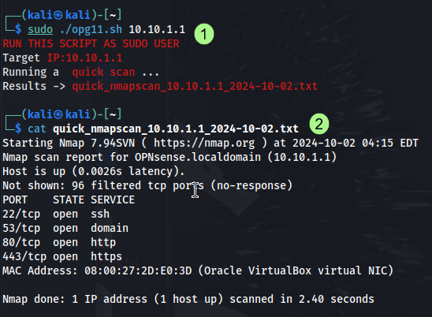
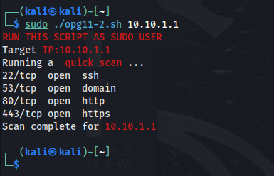

# Uge 40 - Scripting i Bash og Powershell

### [Øvelse 11 - Forstå bash script + tilrette script](https://ucl-pba-its.gitlab.io/24e-its-intro/exercises/11_intro_opgave_bash_scripts/)

I denne øvelse fik vi udleveret følgende script:

```bash
#!/bin/bash

# Add color to the shell output https://techstop.github.io/bash-script-colors/
RED='\033[0;31m'
WHITE='\033[0;37m'
NC='\033[0m' # no color

echo -e "${RED}RUN THIS SCRIPT AS SUDO USER${WHITE}"
# scriptet printer ovenstående tekst med rød skrift.

if [ $# -eq 1 ]; then # if-statement begynder med at tjekke der kun er ét argument angivet.
    echo -e "Target ${RED}IP:$1${WHITE}" #printer IP-adressen 
else
    echo "Your command line is incorrect" 
    echo -e "Usage example: ${RED} sudo ./nmapScans.sh 10.10.10.121 ${WHITE}"
    exit 1 # else, printer fejlen, og giver et eksempel på hvordan scriptet anvendes korrekt.
fi

# Get the date, will be used in filename
DATE=`date +%Y-%m-%d` # systemets dato indlæses og gemmes i variablen "DATE"
filename=$1_$DATE # variabel oprettes med kombinationen af IP-adressen og datoen.

echo -e "Running a ${RED} quick scan ${WHITE}..." # info om at scanning udføres.
nmap -T4 -F $1 > quick_nmapscan_$filename.txt
# nmap startes med følgende flag:
	# -T4 for aggressiv timing (hurtigere scanning).
	# -F for en hurtig scanning på de mest almindelige porte.
	# $1 er IP-adressen givet som argument.
	# Resultaterne gemmes i filen quick_nmapscan_$filename.txt.
echo -e "Results -> ${RED}quick_nmapscan_$filename.txt${WHITE}"

exit 0 # afslutter scriptet.

```

Jeg har tilføjet kommentarer, der forklarer funktionen af hver linje i koden herover.    
Herunder vises outputtet for scanningen op imod min opnsense router:  


I del 2, skal man tilrette scriptet så det ikke gemmer NMAP-resultaterne i en fil, men printer dem i terminalen:

```bash
echo -e "Running a ${RED} quick scan ${WHITE}..."
nmap -T4 -F $1 | grep open
# i stedet for at gemme resultaterne i en fil, bruges"pipe" og "grep" til at filtrere outputtet, til kun at indeholde de åbne porte.
echo -e "Scan complete for ${RED}$1${WHITE}"

exit 0
```


---
### [Øvelse 15 - Powershell script](https://ucl-pba-its.gitlab.io/24e-its-intro/exercises/15_intro_opgave_powershell_script/)

I denne øvelse skal scriptet fra forrige øvelse konverteres til Powershell.

```shell
Write-Host "RUN THIS SCRIPT AS ADMINISTRATOR"

# Check if an argument (IP address) is provided
if ($args.Count -eq 1) {
    $IP = $args[0]
    Write-Host "Target IP:$IP"
} else {
    Write-Host "Your command line is incorrect"
    Write-Host "Usage example: nmapscan.ps1 10.10.10.xxx"
    exit 1
}

# Get the current date for filename
$Date = Get-Date -Format "yyyy-MM-dd"
$filename = "${IP}_$Date.txt"

Write-Host "Running a quick scan..."

# Execute Nmap command and save output to a file
$nmapResult = nmap -T4 -F $IP
$nmapResult | Out-File -FilePath "quick_nmapscan_$filename"

Write-Host "Results -> quick_nmapscan_$filename"

exit 0

```
Scriptet afviger selvfølgelig lidt i forhold til syntaks, men i bund og grund er det samme fremgangsmåde. Der findes flere online tools der er i stand til at konvertere mellem Bash og Powershell, hvis man har et script man ønsker at anvende i begge miljøer.  
[CodingFleet](https://codingfleet.com/code-converter/bash/powershell/), eller en AI vil fx kunne bruges.


!!! warning "Tillad afvikling af scripts"
	Som standard kan Windows blokere afvikling af scripts af sikkerhedsmæssige årsager. Du skal muligvis ændre PowerShell's "Execution Policy" for at tillade scripts.  
	
	
	- Kør denne kommando for at tillade scripts i den nuværende session:  
	  ```
	  Set-ExecutionPolicy -ExecutionPolicy RemoteSigned -Scope Process
	  ```  
	- Hvis du ønsker at ændre politikken permanent, kan du bruge:  
	```
	Set-ExecutionPolicy -ExecutionPolicy RemoteSigned
	```   
	- Du bliver bedt om at bekræfte ved at skrive "Y" og trykke på Enter.

