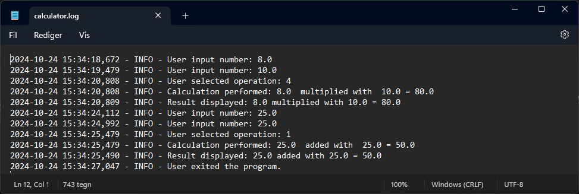

# Uge 41 - Python

### [Øvelse 8 - Opfriskning i Python](https://ucl-pba-its.gitlab.io/24e-its-intro/exercises/8_intro_opgave_python_recap/)

I denne øvelse udleveres følgende python lommeregner program:
```python linenums="1" title="simple_calculator.py"
def add(num1, num2):
    return num1 + num2

def sub(num1, num2):
    return num1 - num2

def div(num1, num2):
    return num1 / num2

def mult(num1, num2):
    return num1 * num2

print('\nWelcome to the simple calculator (write q to quit)')

result = 0.0
chosen_operation = ''

while True:
    print('enter the first number')
    number1 = input('> ')
    if number1 == 'q':
        print('goodbye...')
        break
    print('enter the second number')
    number2 = input('> ')
    if number2 == 'q':
        print('goodbye...')
        break
    print('would like to: 1. add 2. subtract 3. divide or 4. multiply the numbers?')
    operation = input('> ')
    if operation == 'q':
        print('goodbye...')
        break

    try:
        number1 = float(number1)
        number2 = float(number2)
        operation = int(operation)

        if operation == 1:
            result = add(number1, number2)
            chosen_operation = ' added with '
        elif operation == 2:
            result = sub(number1, number2)
            chosen_operation = ' subtracted from '
        elif operation == 3:
            result = div(number1, number2)
            chosen_operation = ' divided with '
        elif operation == 4:
            result = mult(number1, number2)
            chosen_operation = ' multiplied with '

        print(str(number1) + chosen_operation + str(number2) + ' = ' + str(result))
        print('restarting....')

    except ValueError:
        print('only numbers and "q" is accepted as input, please try again')

    except ZeroDivisionError:
        print('cannot divide by zero, please try again')
```

Første del af øvelsen er at reducere gentagelserne i det eksisterende program, altså at abstrahere så meget som muligt til funktioner:

Jeg tilføjer fire nye funktioner til de programmet, for at erstatte de mange if/try statements fra tidligere:  
`#!py3 get_number()`: funktion der håndterer brugerinput og validering.  

`#!py3 get_operation()`: funktion der håndterer brugerens valg af regneoperation.  

`#!py3 calculate()`: Denne funktion håndterer selve udregningen baseret på brugerens input.  

`#!py3 main()`: Hovedprogrammet er nu mere overskueligt, da indlæsning af data, valg af operation, og selve beregningen er abstraheret til separate funktioner.

```py linenums="1" title="simple_calculator_optimized.py"
def get_number(prompt): # Handles user input for numbers and quits if 'q' is entered.
    while True:
        user_input = input(prompt) 
        if user_input == 'q':
            print('goodbye...')
            return None
        try:
            return float(user_input)
        except ValueError:
            print('only numbers and "q" is accepted as input, please try again')

def get_operation(): # Handles user selection of operation and quits if 'q' is entered.
    while True:
        operation = input('Choose an operation: 1. add 2. subtract 3. divide 4. multiply (or "q" to quit): ')
        if operation == 'q':
            print('goodbye...')
            return None
        try:
            operation = int(operation)
            if operation in [1, 2, 3, 4]:
                return operation
            else:
                print('Invalid selection. Please choose 1, 2, 3, or 4.')
        except ValueError:
            print('only numbers and "q" is accepted as input, please try again')

def calculate(num1, num2, operation): # Performs the selected operation on two numbers.
    operations = {
        1: (add, ' added with '),
        2: (sub, ' subtracted from '),
        3: (div, ' divided by '),
        4: (mult, ' multiplied with ')
    }
    func, operation_str = operations.get(operation)
    try:
        result = func(num1, num2)
        return result, operation_str
    except ZeroDivisionError:
        print('cannot divide by zero, please try again')
        return None, None

def add(num1, num2):
    return num1 + num2

def sub(num1, num2):
    return num1 - num2

def div(num1, num2):
    return num1 / num2

def mult(num1, num2):
    return num1 * num2

def main():
    print('\nWelcome to the simple calculator (write q to quit)')
    
    while True:
        number1 = get_number('Enter the first number: ')
        if number1 is None: break
        
        number2 = get_number('Enter the second number: ')
        if number2 is None: break
        
        operation = get_operation()
        if operation is None: break

        result, operation_str = calculate(number1, number2, operation)
        if result is not None:
            print(f'{number1}{operation_str}{number2} = {result}')
            print('restarting....')

if __name__ == '__main__':
    main()

```

---

I næste del af opgaven skal programmet udvides med en .log fil der holder styr på inputs og resultater.  
Til at håndtere det anvendes Pythons logging modul, som importeres og konfigureres som angivet herunder:  
```py
import logging

# Configure logging
logging.basicConfig(filename='calculator.log',
                    encoding='utf-8',
                    filemode='a',
                    level=logging.INFO,
                    format='%(asctime)s - %(levelname)s - %(message)s')
```

For en uddybende forklaring af indstillingerne se den officielle dokumentation her: [https://realpython.com/python-logging/.](https://realpython.com/python-logging/)

Nu kan der tilføjes loglinjer i relevante dele af programmet, som når brugeren indtaster data, når resultater beregnes, og når der opstår fejl. Et eksempel på dette er linjen `logging.info('User exited the program.')`. Når den tilføjes i if-statementet for afbrydelse af programmet, vil den generere en besked af niveauet "INFO", bestående af teksten "User exited the program."

```py linenums="1" title="calculator_logging.py"
import logging

# Configure logging
logging.basicConfig(filename='calculator.log',
                    encoding='utf-8',
                    filemode='a',
                    level=logging.INFO,
                    format='%(asctime)s - %(levelname)s - %(message)s')

def get_number(prompt): # Handles user input for numbers and quits if 'q' is entered.
    while True:
        user_input = input(prompt)
        if user_input == 'q':
            logging.info('User exited the program.')
            print('goodbye...')
            return None
        try:
            number = float(user_input)
            logging.info(f'User input number: {number}')
            return number
        except ValueError:
            logging.error('Invalid input for number.')
            print('only numbers and "q" is accepted as input, please try again')

def get_operation(): # Handles user selection of operation and quits if 'q' is entered.
    while True:
        operation = input('Choose an operation: 1. add 2. subtract 3. divide 4. multiply (or "q" to quit): ')
        if operation == 'q':
            logging.info('User exited the program.')
            print('goodbye...')
            return None
        try:
            operation = int(operation)
            if operation in [1, 2, 3, 4]:
                logging.info(f'User selected operation: {operation}')
                return operation
            else:
                logging.warning('Invalid operation selected.')
                print('Invalid selection. Please choose 1, 2, 3, or 4.')
        except ValueError:
            logging.error('Invalid input for operation.')
            print('only numbers and "q" is accepted as input, please try again')

def calculate(num1, num2, operation): # Performs the selected operation on two numbers.
    operations = {
        1: (add, ' added with '),
        2: (sub, ' subtracted from '),
        3: (div, ' divided by '),
        4: (mult, ' multiplied with ')
    }
    func, operation_str = operations.get(operation)
    try:
        result = func(num1, num2)
        logging.info(f'Calculation performed: {num1} {operation_str} {num2} = {result}')
        return result, operation_str
    except ZeroDivisionError:
        logging.error('Attempted to divide by zero.')
        print('cannot divide by zero, please try again')
        return None, None

def add(num1, num2):
    return num1 + num2

def sub(num1, num2):
    return num1 - num2

def div(num1, num2):
    return num1 / num2

def mult(num1, num2):
    return num1 * num2

def main():
    print('\nWelcome to the simple calculator (write q to quit)')
    
    while True:
        number1 = get_number('Enter the first number: ')
        if number1 is None: break
        
        number2 = get_number('Enter the second number: ')
        if number2 is None: break
        
        operation = get_operation()
        if operation is None: break

        result, operation_str = calculate(number1, number2, operation)
        if result is not None:
            print(f'{number1}{operation_str}{number2} = {result}')
            logging.info(f'Result displayed: {number1}{operation_str}{number2} = {result}')
            print('restarting....')

if __name__ == '__main__':
    main()
```


---

Næste del af øvelsen går på at omskrive programmet så regne funktionerne og logging funktionaliteten opdeles i klasser og efterfølgende importeres og anvendes i et separat python program.

Først opretter jeg filen herunder, indeholdende regnefunktionerne i klassen `Calculations`:
```py linenums="1" title="calculations.py"
class Calculations:

    def add(self, num1, num2):
        return num1 + num2

    def sub(self, num1, num2):
        return num1 - num2

    def div(self, num1, num2):
        return num1 / num2

    def mult(self, num1, num2):
        return num1 * num2

    def calculate(self, num1, num2, operation): # Performs the selected operation on two numbers.
        operations = {
            1: (self.add, ' added with '),
            2: (self.sub, ' subtracted from '),
            3: (self.div, ' divided by '),
            4: (self.mult, ' multiplied with ')
        }
        func, operation_str = operations.get(operation)
        try:
            result = func(num1, num2)
            return result, operation_str
        except ZeroDivisionError:
            raise ZeroDivisionError('Cannot divide by zero')

```

Herefter oprettes log_module.py, med klassen `Logger`

```py linenums="1" title="log_module.py"
import logging

class Logger:
    
    def __init__(self, log_filename='calculator.log'):
        self.log_filename = log_filename
        self.setup_logging()

    def setup_logging(self):
        logging.basicConfig(filename=self.log_filename,
                            level=logging.INFO,
                            format='%(asctime)s - %(levelname)s - %(message)s')

    def log_input(self, number, input_type="number"):
        logging.info(f'User input {input_type}: {number}')
    
    def log_operation(self, operation):
        logging.info(f'User selected operation: {operation}')
    
    def log_result(self, num1, num2, result, operation_str):
        logging.info(f'Calculation: {num1} {operation_str} {num2} = {result}')
    
    def log_error(self, error_msg):
        logging.error(error_msg)
    
    def log_exit(self):
        logging.info('User exited the program.')
```
Med de to klasser oprettet, samles det hele i python programmet `calculator.py`,:

```py linenums="1" title="calculator.py"
from calculations import Calculations
from log_module import Logger

def get_number(prompt, logger): # Handles user input for numbers and quits if 'q' is entered.
    while True:
        user_input = input(prompt)
        if user_input == 'q':
            logger.log_exit()
            print('goodbye...')
            return None
        try:
            number = float(user_input)
            logger.log_input(number)
            return number
        except ValueError:
            logger.log_error('Invalid input for number.')
            print('only numbers and "q" is accepted as input, please try again')

def get_operation(logger): # Handles user selection of operation and quits if 'q' is entered.
    while True:
        operation = input('Choose an operation: 1. add 2. subtract 3. divide 4. multiply (or "q" to quit): ')
        if operation == 'q':
            logger.log_exit()
            print('goodbye...')
            return None
        try:
            operation = int(operation)
            if operation in [1, 2, 3, 4]:
                logger.log_operation(operation)
                return operation
            else:
                print('Invalid selection. Please choose 1, 2, 3, or 4.')
        except ValueError:
            logger.log_error('Invalid input for operation.')
            print('only numbers and "q" is accepted as input, please try again')

def main():
    print('\nWelcome to the simple calculator (write q to quit)')
    
    calculator = Calculations()
    logger = Logger()

    while True:
        number1 = get_number('Enter the first number: ', logger)
        if number1 is None: break
        
        number2 = get_number('Enter the second number: ', logger)
        if number2 is None: break
        
        operation = get_operation(logger)
        if operation is None: break

        try:
            result, operation_str = calculator.calculate(number1, number2, operation)
            print(f'{number1}{operation_str}{number2} = {result}')
            logger.log_result(number1, number2, result, operation_str)
            print('restarting....')
        except ZeroDivisionError as e:
            logger.log_error(str(e))
            print('cannot divide by zero, please try again')

if __name__ == '__main__':
    main()
```
Denne opbygning har flere fordele. Modulariteten sikrer, at funktionerne for beregning og logging er adskilt i klasser, hvilket gør koden lettere at vedligeholde og udvide. Samtidig bliver læsbarheden forbedret, da koden er mere organiseret, og det er nemt at identificere, hvilke dele der hører til beregning, og hvilke der hører til logning. Og så er det nu muligt at genanvende koden fra de enkelte klasser i andre programmer.

---