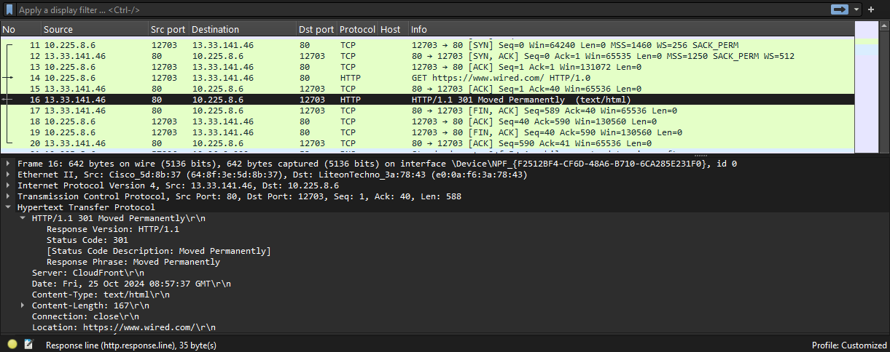

# Uge 43 - Programmering med netværk

### [Øvelse 12 - Python netværks programmering](https://ucl-pba-its.gitlab.io/24e-its-intro/exercises/12_intro_opgave_python_nw/)

**Information**
Python har flere biblioteker der gør det forholdsvist simpelt at kommunikere over netværk.
I denne øvelse får du fingrene i:

* `socket` biblioteket til at kommunikere via sockets.
* `urllib` biblioteket der gør det simpelt at arbejde med Uniform Resource Locators https://developer.mozilla.org/en-US/docs/Learn/Common_questions/What_is_a_URL
* `BeatifulSoup` til at parse html sider og filtrere på html tags, id, klasser mm.
* `Feedparser` til at parse RSS feeds http://www.rss-specifications.com/

**Instruktioner**
1. Fork projektet https://gitlab.com/npes-py-experiments/network-programs til dit eget gitlab namespace
2. Klon projektet til din computer
3. Lav et virtual environment og installer dependencies som beskrevet i readme.md filen https://gitlab.com/npes-py-experiments/network-programs#development-usage

#### Socket biblioteket

1. Læs om pythons socket bibliotek https://docs.python.org/3/library/socket.html
2. Læs koden i `socket_1.py`: Hvad gør koden og hvordan bruger den socket biblioteket?
3. Kør koden med default url og observer hvad der sker, du kan også prøve at single steppe filen for at kunne følge med i variabler osv.
4. Åben wireshark (installer det hvis du ikke allerede har det)
5. Kør koden igen med default url, analyser med wireshark og besvar følgende:
    * Hvad er destinations ip?
    >192.241.136.170
    * Hvilke protokoller benyttes?
    > TCP og HTTP.
    * Hvilken content-type bruges i http header?
    >text/plain
    * Er data krypteret?
    >Nej, det er plaintext.
    * Hvilken iso standard handler dokumentet om?
    >Teksten er fra Romeo og Julie :)
6. Læs socket_2.py og undersøg hvordan linje 38 - 47 kan tælle antal modtagne karakterer?  
>While-loopet henter og decoder data fra serveren i stykker af 500 bytes.  
>Et for-loop gennemgår den modtagede data, tæller det samlede antal tegn og printer de første 3.000 karakterer.
7. Kør socket_2.py og prøv at hente forskellige url's der benytter https, hvad modtager du, hvilken http response får du, hvad betyder de og er de krypteret?
>Jeg modtager HTTP Headers efterfulgt af HTML-indholdet for siden. HTTP-response er `HTTP/1.1 301 Moved Permanently`, som betyder at man redirectes til en side - formentlig til en sikker udgave af hjemmesiden(HTTPS). Svaret er ikke krypteret.
8. Gentag trin 7 og analyser med wireshark for at finde de samme informationer der.
> 
9. Åben socket_3.py, analyser koden og omskriv den så kun http headers udskrives.
>I koden oprettes der en variabel "pos", som finder positionen mellem http-headers og den blanke linje som skiller headers og content. 
>
>Variablen "content" dekoder teksten efter den satte position, som så efterfølgende printes.
>
>For at printe http-headers kan man bede programmet om kun at dekode og printe teksten før den satte position, som vist i koden herunder:

```py
import socket

mysock = socket.socket(socket.AF_INET, socket.SOCK_STREAM)
mysock.connect(('data.pr4e.org', 80))
cmd = 'GET http://data.pr4e.org/intro-short.txt HTTP/1.0\r\n\r\n'.encode()
mysock.send(cmd)

received =b"" #Stores recieved data in bytes

while True:
    data = mysock.recv(512)
    if len(data) < 1:
        break
    received += data
pos = received.find(b"\r\n\r\n") #Look for position of header & blank line
# content = received[pos+4:].decode() 
# print(content)

headers = received[:pos].decode()
print(headers)

mysock.close()
```

---

#### urllib biblioteket

1. Læs om urllib biblioteket https://docs.python.org/3/library/urllib.html.
2. Åbn urllib_1.py og læs koden, hvordan er syntaksen ifht. socket 1-3 programmerne?
>   * **Abstraktionsniveau:** urllib.request håndterer HTTP-forespørgslen og header-udtrækningen automatisk, hvor socket krævede, at vi byggede en HTTP-forespørgsel manuelt.
>
>    * **Kodesimplicitet:** urllib giver en enklere og mere brugervenlig syntaks, der kræver mindre opsætning, mens socket giver større kontrol over netværkskommunikationen.
>
>   * **Automatisk håndtering af HTTP-headere:** I urllib_1.py håndteres headere af urllib, hvilket betyder, at vi kun modtager indholdet direkte.
3. Hvilket datasvar får du retur hvis du prøver at hente via https, f.eks https://docs.python.org/3/library/urllib.html
>Sidens HTML-indhold
4. Kør programmet igen med https://docs.python.org/3/library/urllib.html og analyser i wireshark, besvar følgende:
    * Hvad er destinations ip?
    >151.101.64.223.
    * Hvilke protokoller benyttes?
    >TCP, TLS og HTTP.
    * Hvilken content-type bruges i http(s) header?
    > Kan ikke aflæses i Wireshark, da trafikken er krypteret med TLS.(https)
    * Er data krypteret?
    >Ja.
    * Hvor mange cipher suites tilbydes i Client hello?
    >18 suites.
    * Hvilken TLS version og cipher suite bliver valgt i Server Hello?
    >TLSv1.2 og Cipher Suite: TLS_AES_128_GCM_SHA256 (0x1301).

---

#### BeautifulSoup biblioteket

1. Læs om BeatifulSoup biblioteket https://beautiful-soup-4.readthedocs.io/en/latest/
2. Hvad er formået med biblioteket?
>BeautifulSoup er et Python-bibliotek, der bruges til at analysere, gennemgå og manipulere HTML- og XML-dokumenter.
3. Åbn urllib_2.py og analyser koden for at finde ud af hvad den gør.
>Denne kode tager en URL som input, henter siden, og parser HTML’en for at finde antallet af <p>-tags. Dette kan bruges til at tælle afsnit på en webside og giver en introduktion til web scraping med BeautifulSoup og urllib.
4. Kør programmet.
>`found 29 p tags @ https://docs.python.org`
5. Ret i programmet så det tæller et andet HTML tag.
```py
    # Retrieve all of the anchor tags
    count = 0
    tags = soup('a')
    count = len(tags)
    # for tag in tags:
    #     count += 1

    print(f'found {count} <a> tags @ {url}')
```
>`found 88 <a> tags @ https://docs.python.org`

6. Ret i programmet så det bruger BeatifulSoups .findall() metode.
```py title="BeautifulSoup_findall.py"
from urllib.request import Request, urlopen
import urllib.error
from bs4 import BeautifulSoup
import ssl

# Ignore SSL certificate errors
ctx = ssl.create_default_context()
ctx.check_hostname = False
ctx.verify_mode = ssl.CERT_NONE

url = input('Enter a url: ')
if url == "":
    url = 'https://docs.python.org'

# Setup HTTP request with user-agent header
req = Request(url, headers={'User-agent': 'Mozilla/5.0'})

# Fetch and parse HTML content
html = urllib.request.urlopen(req, context=ctx).read()
soup = BeautifulSoup(html, 'html.parser')

# Retrieve all of the <p> tags using find_all()
tags = soup.find_all('a')
count = len(tags)

print(f'found {count} p tags @ {url}')
```
>Ændringer:  
Vi bruger nu `#!python soup.find_all('a')` til at finde alle a-tags. Dette er en mere præcis metode, som returnerer en liste med alle elementer, der matcher tagget.
Variablen tags vil indeholde alle a-tags, og vi kan herefter tælle dem med len(tags).
Denne ændring gør koden mere eksplicit og anvender en af de mest brugte metoder i BeautifulSoup.

---

#### Feedparser biblioteket

1. Læs om feedparser biblioteket https://feedparser.readthedocs.io/en/latest/.
>Feedparser bruges til at analysere og håndtere RSS-feeds.
2. Åbn rssfeed_parse.py og analyser koden for at finde ud af hvad den gør?
>Koden henter RSS-feedet fra "The Hacker News," udtrækker information fra hver artikel, og genererer en Markdown-fil.
3. Linje 28, som formatterer modtaget data, har en meget lang sætning.
    ```py title="rssfeed_parse.py"
    f'# {entry.title}\n**_Author: {entry.author}_**  \nPublished:  {entry.published}  \n**_Summary_**  \n{re.sub(r"[^a-zA-Z0-9]", " ", entry.summary).replace(" adsense ", " ").replace(" lt ", " ").replace(" gt ", " ")}  \n  \nLink to full article:  \n[{entry.link}]({entry.link})\n' 
    ```
    Hvad gør den? (du kan prøve at erstatte den med {entry.summary} for at se forskellen)
>Den bestemmer formateringen i den generede markdown fil.
4. Find et passende sikkerheds relateret rss feed, på internettet, du vil parse.
> [Heimdal Security](https://heimdalsecurity.com/blog/feed/)
5. Omskriv rssfeed_parse.py til at bruge dit valgte feed, ret i formatteringen, så du får et output i markdown filen, der svarer til:
    ```md
    # Headline/title

    **_Author:_**
    **_Summary:_**
    [link_to_full_article](link_to_full_article)
    ```
```py title="Heimdal_RSS_Parser.py"
import feedparser
from bs4 import BeautifulSoup
import re

# RSS URL
feed_url = 'https://heimdalsecurity.com/blog/feed/'

# Parse RSS feed
rss_feed = feedparser.parse(feed_url)

file_entry_list = []

for entry in rss_feed.entries:
    # Hent titel og link
    title = entry.title
    link = entry.link

    # Prøv at hente forfatter fra dc:creator eller author
    author = entry.get('dc_creator') or entry.get('author', 'Unknown')

    # Brug BeautifulSoup til at rense HTML i beskrivelsen
    description = BeautifulSoup(entry.description, 'html.parser').text

    # Formater Markdown-indhold
    file_entry_list.append(
        f"# {title}\n**_Author:_** {author}\n**_Summary:_** {description}\n[link_to_full_article]({link})\n\n"
    )

# Skriv til markdown-fil med UTF-8-kodning
with open('Heimdahl_feed.md', 'w', encoding='utf-8') as file:
    file.write(''.join(file_entry_list))
```