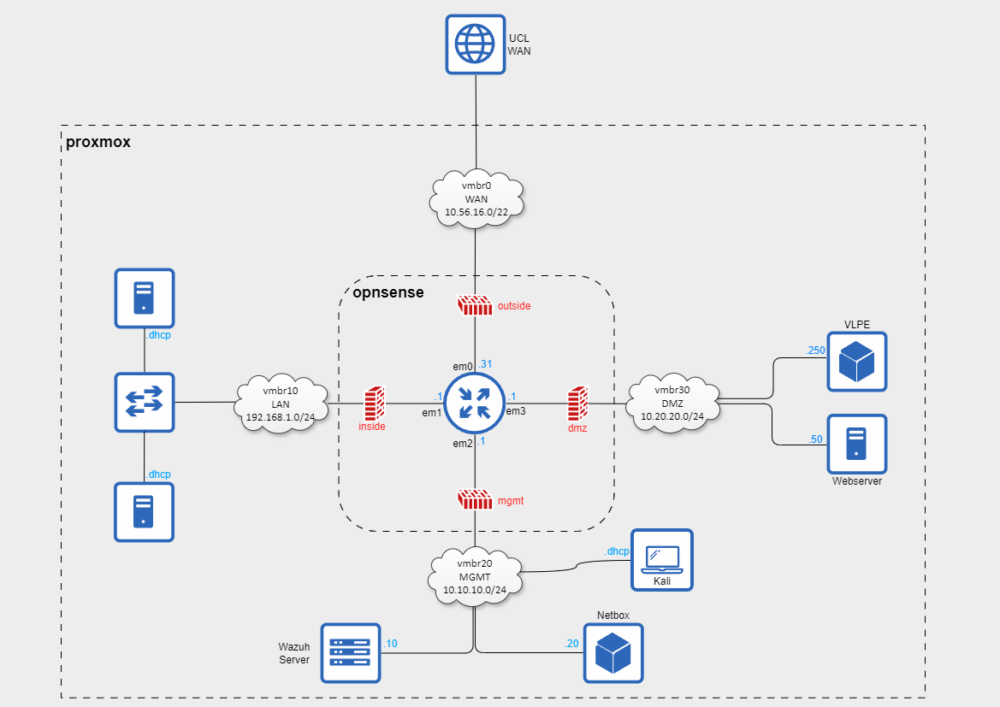
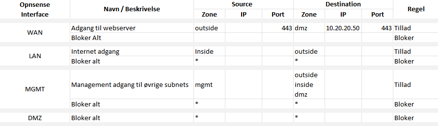

# Uge 10 - Designe og dokumentere netværk

## Øvelse 53 - Netværksdesign

Opogaven består i at designe et netværk som understøtter følgende enheder:

* OPNsense router (du bestemmer selv antal interfaces)
* Webserver vm der server en intranet side via https
* Server vm der opsamler netværkslog fra OPNsense (her benyttes graylog i docker compose)
* Server vm der kører usikre services i vulnerable-pentesting-lab-environment
* Kali vm der benyttes af netværksadministratoren til at teste netværket

#### Inventarliste

*Lav en inventar liste med minimum porte og protokoller som services på de virtuelle maskiner benytter.*  

| Hostname | Device Type     | Interface | IP Address   | CIDR | Service/Port/Protocol                                                                 | Security Zone |
|----------|-----------------|-----------|--------------|------|--------------------------------------------------------------------------------------|---------------|
| opnsense | router/firewall | em0       | 10.56.16.31  | 22   |                                                                                      | outside       |
|          |                 | em1       | 192.168.1.1  | 24   |                                                                                      | inside        |
|          |                 | em2       | 10.10.10.1   | 24   | https/443/tcp, ssh/22/tcp                                                            | mgmt          |
|          |                 | em3       | 10.20.20.1   | 24   |                                                                                      | dmz           |
| webserver| ubuntu server   | eth0      | 10.20.20.50  | 24   | http/80/tcp, https/443/tcp                                                           | dmz           |
| wazuh    | ubuntu server   | eth0      | 10.10.10.10  | 24   | 1514 (tcp/udp), 1515 (tcp), 1516 (tcp), 514 (tcp/udp), 55000 (tcp), 9200 (tcp), 9300-9400 (tcp), 443 (tcp) | mgmt          |
| VPLE     | Pentest Lab     | ens33     | 10.20.20.250 | 24   | 1335-1337 (tcp), 8080 (tcp), 3000 (tcp), 8899 (tcp), 8800 (tcp)                      | dmz           |
| Kali     |                 | ens33     | .dhcp        | -    |                                                                                      | mgmt          |
| Netbox   |                 | eth0      | 10.10.10.20  | 24   | 8001 (tcp), 443 (tcp), 5432 (tcp), 6379-6380 (tcp), 22 (tcp)                        | mgmt          |

#### Netværksdiagram

*Lav et netværksdiagram med passende segmentering til de virtuelle maskiner. (Lav segmentering med seperate interfaces der hver har 1 netværk. Anvend ikke VLANs).*

#### Firewall

*Angiv i en tabel hvilke firewallregler du vil konfigurere. Redegør for dine valg*

Ud fra allowlist koncepteret konfigureres der en "bloker alt" regel på hvert interface.  

Da firewallen behandler reglerne i rækkefølge til den finder et match, skal den trafik man vil tillade placeres over "bloker alt" reglen.
Eksempelvis på WAN interfacet, hvor der konfigureres en regel som åbner for udefrakommende trafik på port 443 til Webserverens ip-adresse placeret i security zonen "dmz".
