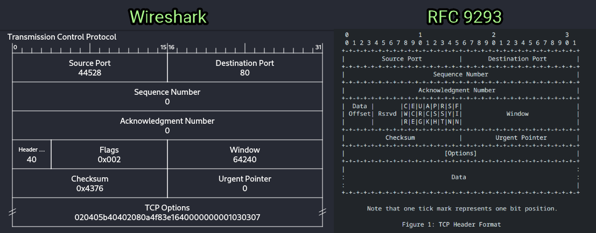
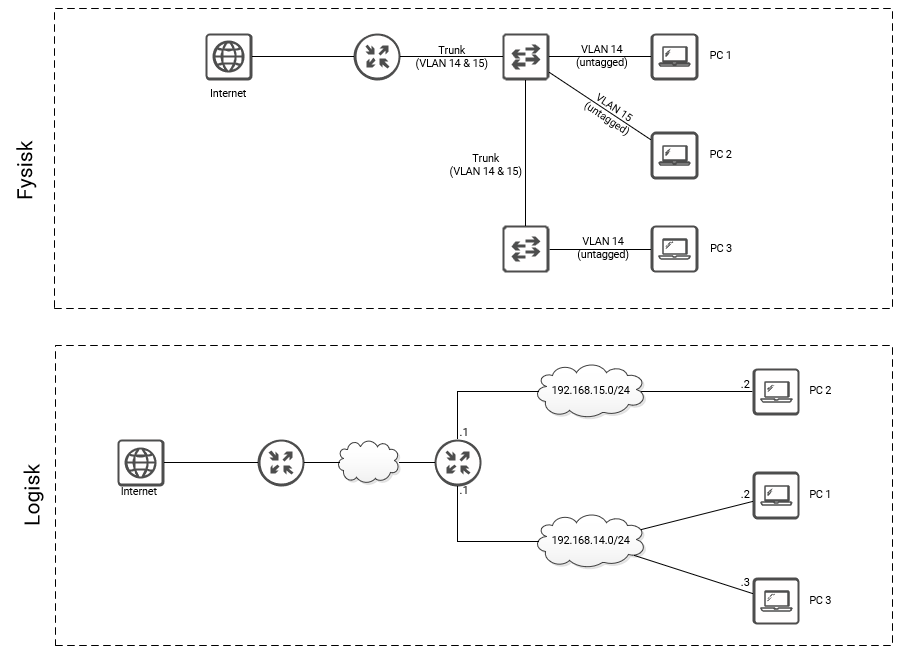

# Uge 8 - OSI modellen og netværks protokoller

### Øvelse 12 - Protokoller og OSI modellen
Optag trafik i Wireshark og udfør følgende.  

* Lav en liste over de protokoller der optræder i trafikken og placer protokollerne i OSI modellen:

| Protokol       | OSI Lag             |
| -------------- | ------------------- |
| UDP            | Transport (Lag 4)   |
| QUIC           | Transport (Lag 4)   |
| TCP            | Transport (Lag 4)   |
| Frame          | Data Link (Lag 2)   |
| IP             | Netværk (Lag 3)     |
| DNS            | Applikation (Lag 7) |
| HTTP           | Applikation (Lag 7) |
| ETH (Ethernet) | Data Link (Lag 2)   |
| TLS            | Transport (Lag 4)   |
| OCSP           | Applikation (Lag 7) |


* Find minimum et eksempel, med kildehenvisning, på hvordan en af jeres fundne protokoller kan misbruges af en trusselsaktør:
	* DNS cache poisoning: hvor angribere indsætter falske DNS-oplysninger i en cachelagret DNS-server. Dette kan føre til, at brugere bliver omdirigeret til ondsindede websites, selv når de indtaster det korrekte domænenavn.  
	[https://www.cloudflare.com/learning/dns/dns-cache-poisoning/](https://www.cloudflare.com/learning/dns/dns-cache-poisoning/)

---

### Øvelse 13 - Protokolforståelse
* Find et TCP 3-way handshake i trafikken og sammenlign wireshark dataen med beskrivelsen i [RFC9293 afsnit 3.5](https://www.rfc-editor.org/rfc/rfc9293.pdf) og se om i kan se en sammenhæng?




Find et TLS handshake i jeres wireshark trafik og identificer `Client Hello`:

* Hvor mange `cipher suites` understøtter klienten? **17 suites.**
* Hvilke TLS versioner understøtter klienten? **TLS 1.3 og TLS 1.2**

Identificer `Server hello` pakken:

* Hvilken cipher suite vælger serveren? **TLS_AES_128_GCM_SHA256 (0x1301)**
* Hvilken TLS version vælger serveren? **TLS 1.2**


=== "Client Hello"

    ```
    Handshake Protocol: Client Hello
        Handshake Type: Client Hello (1)
        Length: 649
        Version: TLS 1.2 (0x0303)
            [Expert Info (Chat/Deprecated): This legacy_version field MUST be ignored. The supported_versions extension is present and MUST be used instead.]
        Random: d7365505bdcbf72d3b227d3fc2cf9b55301c18359c9d9f4dcb51186d70db03ca
        Session ID Length: 32
        Session ID: 3167bcc17e49406da8ca47864817b20737536ba03cd978c590e1f966d6b1b47e
        Cipher Suites Length: 34
        Cipher Suites (17 suites)
        Compression Methods Length: 1
        Compression Methods (1 method)
        Extensions Length: 542
        Extension: server_name (len=15) name=www.ucl.dk
            Type: server_name (0)
            Length: 15
            Server Name Indication extension
        Extension: extended_master_secret (len=0)
            Type: extended_master_secret (23)
            Length: 0
        Extension: renegotiation_info (len=1)
            Type: renegotiation_info (65281)
            Length: 1
            Renegotiation Info extension
        Extension: supported_groups (len=14)
            Type: supported_groups (10)
            Length: 14
            Supported Groups List Length: 12
            Supported Groups (6 groups)
        Extension: ec_point_formats (len=2)
            Type: ec_point_formats (11)
            Length: 2
            EC point formats Length: 1
            Elliptic curves point formats (1)
        Extension: session_ticket (len=0)
            Type: session_ticket (35)
            Length: 0
            Session Ticket: <MISSING>
        Extension: application_layer_protocol_negotiation (len=14)
            Type: application_layer_protocol_negotiation (16)
            Length: 14
            ALPN Extension Length: 12
            ALPN Protocol
        Extension: status_request (len=5)
            Type: status_request (5)
            Length: 5
            Certificate Status Type: OCSP (1)
            Responder ID list Length: 0
            Request Extensions Length: 0
        Extension: delegated_credentials (len=10)
            Type: delegated_credentials (34)
            Length: 10
            Signature Hash Algorithms Length: 8
            Signature Hash Algorithms (4 algorithms)
        Extension: key_share (len=107) x25519, secp256r1
            Type: key_share (51)
            Length: 107
            Key Share extension
        Extension: supported_versions (len=5) TLS 1.3, TLS 1.2
            Type: supported_versions (43)
            Length: 5
            Supported Versions length: 4
            Supported Version: TLS 1.3 (0x0304)
            Supported Version: TLS 1.2 (0x0303)
        Extension: signature_algorithms (len=24)
            Type: signature_algorithms (13)
            Length: 24
            Signature Hash Algorithms Length: 22
            Signature Hash Algorithms (11 algorithms)
        Extension: psk_key_exchange_modes (len=2)
            Type: psk_key_exchange_modes (45)
            Length: 2
            PSK Key Exchange Modes Length: 1
            PSK Key Exchange Mode: PSK with (EC)DHE key establishment (psk_dhe_ke) (1)
        Extension: record_size_limit (len=2)
            Type: record_size_limit (28)
            Length: 2
            Record Size Limit: 16385
        Extension: encrypted_client_hello (len=281)
            Type: encrypted_client_hello (65037)
            Length: 281
            Client Hello type: Outer Client Hello (0)
            Cipher Suite: HKDF-SHA256/AES-128-GCM
            Config Id: 72
            Enc length: 32
            Enc: 40b1f47a9f104653ae0225ca8afac3b71e210608d0bc16c92d7d30e66501937f
            Payload length: 239
            Payload […]: ed1839ba39cf4c89f73936782414a8b59f79713b43e6af734d03c8542117a475d23216664a66b24eb964580708cb4828afadd34d28b56f18c0eb5b3a701b8cd88c958a919243770e07246c55314e17a86871518db853f8424bfc9199ca18c2ef795f4d0571e9b37c98337306da17f6ac
        [JA4: t13d1715h2_5b57614c22b0_5c2c66f702b0]
        [JA4_r: t13d1715h2_002f,0035,009c,009d,1301,1302,1303,c009,c00a,c013,c014,c02b,c02c,c02f,c030,cca8,cca9_0005,000a,000b,000d,0017,001c,0022,0023,002b,002d,0033,fe0d,ff01_0403,0503,0603,0804,0805,0806,0401,0501,0601,0203,0201]
        [JA3 Fullstring: 771,4865-4867-4866-49195-49199-52393-52392-49196-49200-49162-49161-49171-49172-156-157-47-53,0-23-65281-10-11-35-16-5-34-51-43-13-45-28-65037,29-23-24-25-256-257,0]
        [JA3: b5001237acdf006056b409cc433726b0]
    ```

=== "Server Hello"

    ```
    Handshake Protocol: Server Hello
        Handshake Type: Server Hello (2)
        Length: 118
        Version: TLS 1.2 (0x0303)
            [Expert Info (Chat/Deprecated): This legacy_version field MUST be ignored. The supported_versions extension is present and MUST be used instead.]
        Random: 6373bf9b3391932d7adb524392b4bd9a67850d0bf417cf5272a77c598fa47b04
        Session ID Length: 32
        Session ID: 3167bcc17e49406da8ca47864817b20737536ba03cd978c590e1f966d6b1b47e
        Cipher Suite: TLS_AES_128_GCM_SHA256 (0x1301)
        Compression Method: null (0)
        Extensions Length: 46
        Extension: key_share (len=36) x25519
            Type: key_share (51)
            Length: 36
            Key Share extension
        Extension: supported_versions (len=2) TLS 1.3
            Type: supported_versions (43)
            Length: 2
            Supported Version: TLS 1.3 (0x0304)
        [JA3S Fullstring: 771,4865,51-43]
        [JA3S: eb1d94daa7e0344597e756a1fb6e7054]

    ```

---

### Øvelse 23 - OPNsense Udforskning
| Spørgsmål                                                                                     | Svar                                                                                                                                                   |
| --------------------------------------------------------------------------------------------- | ------------------------------------------------------------------------------------------------------------------------------------------------------ |
| Hvilke features tilbyder OPNsense?                                                            | Firewall and routing platform                                                                                                                          |
| Hvordan kan du kontrollere om din OPNsense-version har kendte sårbarheder?                    | Tjekke CVE records for den pågældende version af OPNsense.   <br>OPNsense Security Advisories                                                          |
| Hvad er Lobby, og hvad kan man gøre derfra?                                                   | Lobby giver et overblik over routerens status og indstillinger.                                                                                        |
| Kan man se NetFlow-data direkte i OPNsense, og i så fald hvor kan man se det?                 | Det kan man under "Reporting -> NetFlow"                                                                                                               |
| Hvad kan man se omkring trafik i Reporting?                                                   | Systemets tilstand, antallet af pakker på tværs af routeren, kvaliteten af netværket, latency osv.                                                     |
| Hvor oprettes VLANs, og hvilken IEEE-standard anvendes?                                       | Interfaces -> Other Types -> VLAN. IEEE 802.1q                                                                                                         |
| Er der konfigureret nogle firewall-regler for jeres interfaces (LAN og WAN)? Hvis ja, hvilke? | "Allow internal DNS"                                                                                                                                   |
| Hvilke slags VPN understøtter OPNsense?                                                       | IPsec, OpenVPN, WireGuard                                                                                                                              |
| Hvilket IDS indeholder OPNsense?                                                              | Suricata                                                                                                                                               |
| Hvor kan man installere os-theme-cicada i OPNsense?                                           | System -> Firmware -> Plugins. Temaet vælges derefter i Settings -> General -> Theme                                                                   |
| Hvordan opdaterer man firmware på OPNsense?                                                   | System -> Firmware -> Status -> Check For Updates                                                                                                      |
| Hvad er nyeste version af OPNsense?                                                           | 25.1 “Ultimate Unicorn” Series                                                                                                                         |
| Hvilken IP-version tildeles som default til hhv. LAN og WAN-interface ved installation?       | LAN: IP-adresse **192.168.1.1/24**<br>WAN: DHCP                                                                                                        |
| Hvilket OS er OPNsense baseret på?                                                            | FreeBSD                                                                                                                                                |
| Hvad betyder Live Mode i OPNsense?                                                            | "Live Mode" er en tilstand, hvor systemet kører direkte fra installationsmediet (såsom en USB-nøgle eller CD) uden at være installeret på en harddisk. |
| Hvilket interface og IP-adresse kan OPNsense webinterfacet tilgås fra?                        | 192.168.1.1                                                                                                                                            |
| Er jeres OPNsense nyeste version? Hvis ikke, så opdater den til nyeste version                | OPNsense 25.1                                                                                                                                          |

---

### Øvelse 40 - Nmap Basic Port Scans
I denne øvelse gennemførte vi TryHackMe rummet [Nmap Basic Port Scans](https://tryhackme.com/room/nmap02)

Øvelserne i rummet forklarede konceptet 3-way handshake og ved at analysrer på TCH-headeren kan vi se de flag som NMAP bruger til at udføre scanninger med TCP-protokollen. Gennem aktive øvelser kunne vi udføre scanninger op mod virtuelle maskiner, og se forskellen på en "connect-scan" og en "SYN-scan", hvor 3-way handshake resettes, så snart NMAP modtager en SYN/ACK fra hosten der scannes. 

Næste del af øvelserne var at udføre en UDP-scanning. Rummet forklarede forskellen på TCP og UDP scanninger. Da UDP er en forbindelsesløs protokol, markerer NMAP en port som åben hvis den ikke modtager et svar på sin UDP-pakke. Hvis porten er lukket vil den returnere en ICMP-pakke type 3, destination unreachable, og code 3, port unreachable.

Til sidst i rummet fik vi introduceret lidt NMAP-syntax som at søge efter bestemte porte og hvordan man kan forsøge at undgå IDS ved brug af timing parametre:
- port list: `-p22,80,443` will scan ports 22, 80 and 443.
- port range: `-p1-1023` will scan all ports between 1 and 1023 inclusive, while `-p20-25` will scan ports between 20 and 25 inclusive
- `-p-`,  will scan all 65535 ports.
- You can control the scan timing using `-T<0-5>`. `-T0` is the slowest (paranoid), while `-T5` is the fastest. According to Nmap manual page, there are six templates:

- paranoid (0)
- sneaky (1)
- polite (2)
- normal (3)
- aggressive (4)
- insane (5)

To avoid IDS alerts, you might consider `-T0` or `-T1`. For instance, `-T0` scans one port at a time and waits 5 minutes between sending each probe, so you can guess how long scanning one target would take to finish. If you don’t specify any timing, Nmap uses normal `-T3`. Note that `-T5` is the most aggressive in terms of speed; however, this can affect the accuracy of the scan results due to the increased likelihood of packet loss. Note that `-T4` is often used during CTFs and when learning to scan on practice targets, whereas `-T1` is often used during real engagements where stealth is more important.

Alternatively, you can choose to control the packet rate using `--min-rate <number>` and `--max-rate <number>`. For example, `--max-rate 10` or `--max-rate=10` ensures that your scanner is not sending more than ten packets per second.

This room covered three types of scans.

|Port Scan Type|Example Command|
|---|---|
|TCP Connect Scan|`nmap -sT 10.10.36.211`|
|TCP SYN Scan|`sudo nmap -sS 10.10.36.211`|
|UDP Scan|`sudo nmap -sU 10.10.36.211`|

These scan types should get you started discovering running TCP and UDP services on a target host.

| Option                  | Purpose                                  |     |
| ----------------------- | ---------------------------------------- | --- |
| `-p-`                   | all ports                                |     |
| `-p1-1023`              | scan ports 1 to 1023                     |     |
| `-F`                    | 100 most common ports                    |     |
| `-r`                    | scan ports in consecutive order          |     |
| `-T<0-5>`               | -T0 being the slowest and T5 the fastest |     |
| `--max-rate 50`         | rate <= 50 packets/sec                   |     |
| `--min-rate 15`         | rate >= 15 packets/sec                   |     |
| `--min-parallelism 100` | at least 100 probes in parallel          |     |

---

### Øvelse 50 - Netværksdiagrammer
Følgende diagrammer skal laves pæne - ie. find et passende diagram værktøj, og lav jeres egen version af det:


Diagrammet tegnet i Visio:



