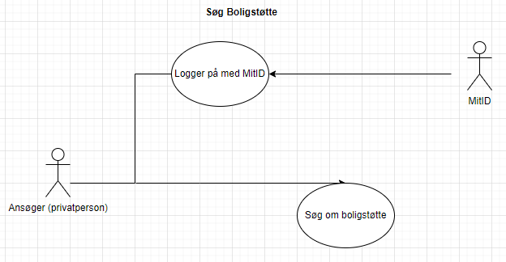
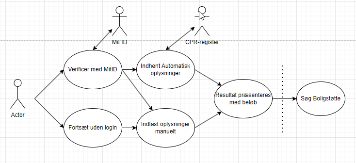
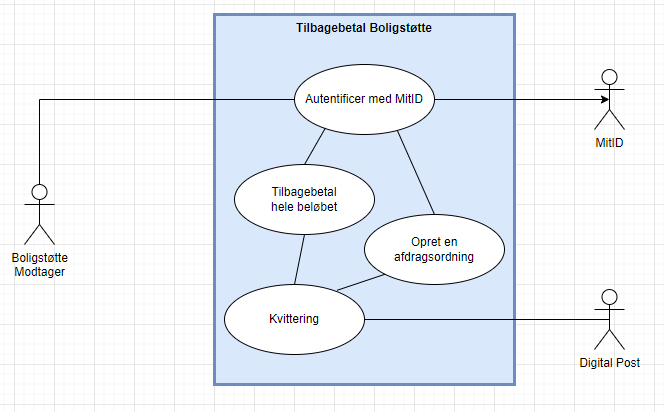
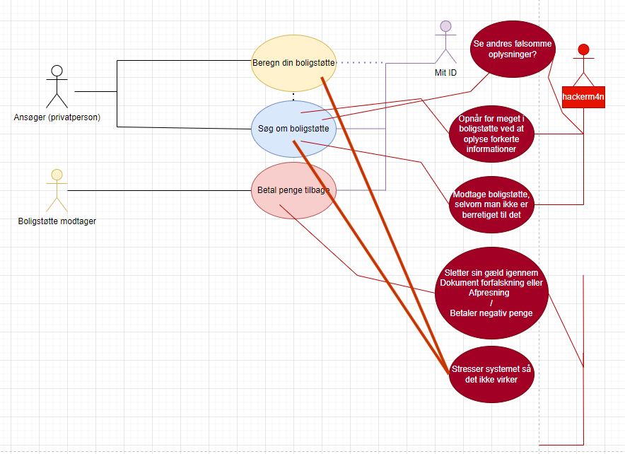

# Uge 37 - System & sikkerheds mål, samt ASP .Net core


**Reflektionspunkter efter forberedelsen og inden undervisningen:**

- **Hvad er læren fra Öst-Götha Bank røveriet?  (_Tænk security in depth_)**  
>At man ikke skal tænke på sikkerhed som enkelte funktioner/brugstilfælde, men i stedet analysere hvad der kan gå galt, op opstille foranstaltninger op for dette.
- **Bør sikkerhed tænkes ind i software design/udvikling som en selvstændig Feature?**  
>Nej, sikkerhed bør ikke ses som en feature.
- **Hvilket type angreb er XSS overordnet? (Listing 1.1 viser en klasse som er sårbar overfor dette)**  
>Cross-site-scripting. Det er et injektionsangreb. Det tillader en angriber at indsætte ondsindet script i en webside, som derefter eksekveres i en anden brugers browser. Formålet kan være at stjæle data, som cookies eller sessionstokens, eller manipulere siden på måder, der kompromitterer sikkerheden.
-  **Hvad er sammenhængen mellem security in depth og software design?**  
>Security in Depth (lagdelt sikkerhed) handler om at implementere flere lag af beskyttelse i et system, så hvis ét sikkerhedslag bryder sammen, er der stadig andre lag, der kan forhindre et fuldstændigt sikkerhedsbrud. I softwaredesign betyder det, at sikkerhed skal integreres i alle dele af udviklingsprocessen, fra design og arkitektur til kode og deployment. Det handler om at undgå, at én enkelt sårbarhed bringer hele systemet i fare.
- **Hvad er forskellen på en use case , og et use case diagram?**  
>•	En use case er en beskrivelse af, hvordan en bruger eller system interagerer med et system for at opnå et bestemt mål. Det er typisk en tekstuel beskrivelse af de trin, der tages for at udføre en bestemt funktionalitet.
•	Et use case diagram er en visuel repræsentation af use cases. Diagrammet viser aktører (brugere eller systemer) og deres relationer til de forskellige use cases i systemet, hvilket giver et hurtigt overblik over systemets funktionalitet.

---

### [Øvelse 8 - Udarbejdelse af systemmål for borger.dk](https://24e-its-software-sikkerhed-ucl-pba-its-16896c745213acc3eaef8347.gitlab.io/exercises/8_Gruppe_%C3%B8velse_udarbejedelse_af_system_m%C3%A5l/)

I denne øvelse skulle vi vælge et område af borger.dk, hvorfra vi skulle udarbejde 3 systemmål med tilhørende brugstilfælde (Use-Case). Vi valgte at fokusere på området Boligstøtte:

#### Use Case nr. 1: Søg Boligstøtte

* Aktør: Ansøger (privatperson)
* Forudsætning: 
>Enkeltperson (borger) med adgang til egen bankkonto og oplysninger
* Beskrivelse: 
>Ansøgeren logger på med sit MitID, udfylder datafelter og søger om boligstøtte igennem selvbetjeningen.  og ansøger modtager senere svar. 




#### Use Case nr. 2: Beregn din boligstøtte

* Aktør: Ansøger (privatperson)
* Forudsætning: 
>Ansøger har adgang til MitID. Ansøger har oplysninger om egen økonomi og boligforhold, såsom husleje og indkomst.
* Beskrivelse: 
>Ansøgeren logger ind på boligstøtte portalen med sit MitID. Her har de mulighed for at simulere, hvor meget boligstøtte de kan få, baseret på deres nuværende økonomi og boligoplysninger. De udfylder de nødvendige data felter, såsom husleje, antal personer i husstanden og indkomst. Systemet beregner herefter et estimat af boligstøtten, som præsenteres for ansøgeren. Ansøgeren modtager en beregning af den forventede boligstøtte, men denne er kun vejledende og ikke en bindende afgørelse.




#### Use Case nr. 3: Betal penge tilbage

* Aktør: Boligstøtte Modtager
* Forudsætning: 
>Modtageren har tidligere modtaget boligstøtte. Der er opstået et tilbagebetalingskrav, f.eks. på grund af en ændring i økonomiske forhold.
* Beskrivelse: 
>Modtageren bliver informeret om, at der er opstået et tilbagebetalingskrav for boligstøtte. Via selvbetjeningsportalen logger modtageren ind med MitID og kan her se detaljer om tilbagebetalingskravet. Modtageren får mulighed for at vælge, om de vil betale beløbet tilbage med det samme eller aftale en afdragsordning. Modtageren vælger den ønskede løsning og gennemfører betalingen eller opretter en betalingsaftale.Systemet opdateres med de nye oplysninger.



---

### [Øvelse 9 - Udarbejdelse af sikkerhedmål for borger.dk](https://24e-its-software-sikkerhed-ucl-pba-its-16896c745213acc3eaef8347.gitlab.io/exercises/9_Gruppe_%C3%B8velse_udarbejedelse_af_sikkerheds_m%C3%A5l/)

Ud fra systemmålene i Øvelse 8, skulle vi nu brainstorme os frem til sikkerhedsmål med tilhørende misbrugstilfælde (Abuse-cases).



---

### [Øvelse 10 - Opret en applikation med ASP.NET Core](https://24e-its-software-sikkerhed-ucl-pba-its-16896c745213acc3eaef8347.gitlab.io/exercises/10_%C3%98velse_Med_ASP_Net_core/)

**Opgaven var at følge denne [Tutorial](https://learn.microsoft.com/en-us/aspnet/core/tutorials/first-web-api?view=aspnetcore-8.0&preserve-view=true&tabs=visual-studio-code):**

Efter oprettelsen fik jeg følgende fejlmeddelelse:
>MINGW64 ~/OneDrive/1. Git/IT-Sikkerhed/Software Sikkerhed/API with ASP.NET Core/TodoApi (main) $ dotnet run --launch-profile https Building... 
C:\Users\benzd\OneDrive\1. Git\IT-Sikkerhed\Software Sikkerhed\API with ASP.NET Core\TodoApi\TodoApi.csproj : error NU1100: Unable to resolve 'Swashbuckle.AspNetCore (>= 6.4.0)' for 'net8.0'. The build failed. Fix the build errors and run again.

Med ChatGPT fandt jeg frem til at Swashbuckle.AspNetCore ikke var tilgængelig i package manageren NuGet. Først skulle NuGet sources opdateres med kommandoen 

```dotnet nuget add source https://api.nuget.org/v3/index.json -n nuget.org```

Herefter kunne pakkerne genskabes med kommandoen:
`dotnet restore`
