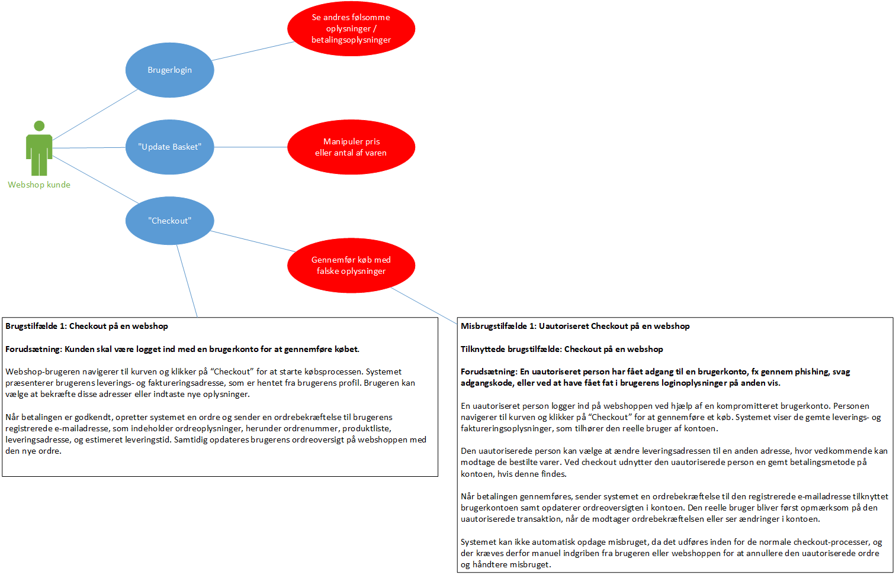
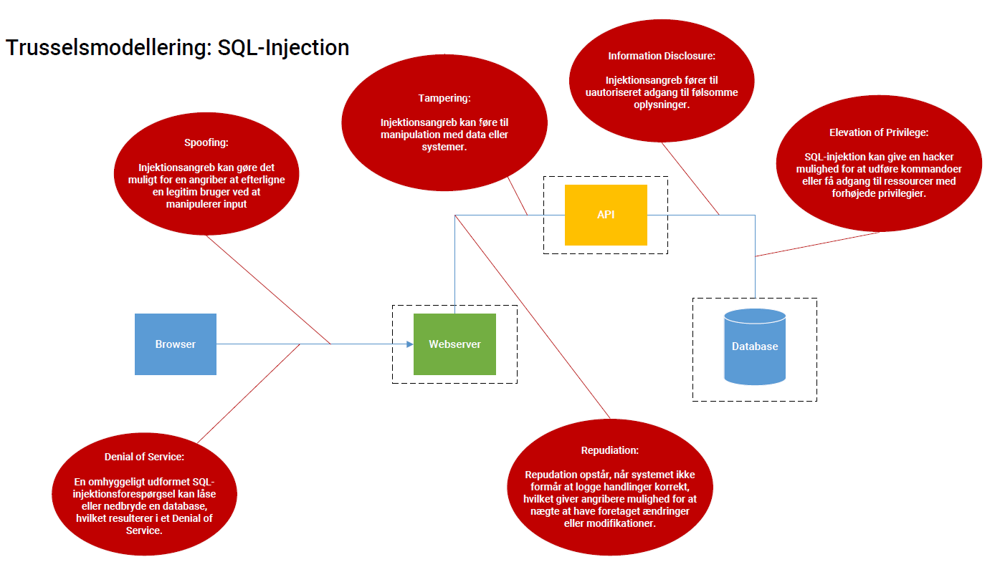

# Uge 38 - Risikovurdering og trusselsmodellering

### [Øvelse 11 - Udarbejd system- og sikkerhedsmål til webapplikation](https://24e-its-software-sikkerhed-ucl-pba-its-16896c745213acc3eaef8347.gitlab.io/exercises/11_Gruppe_%C3%B8velse_Udarbejde_System_og_sikkerheds_m%C3%A5l_til_web_applikation/)
**Information**  
I denne øvelse skal I udarbejde systemmål og sikkerhedsmål til en webapplikation.

Applikationen, I skal udarbejde system- og sikkerhedsmål til, kan findes her: [.Net reference webshop](https://github.com/dotnet-architecture/eShopOnWeb).  
Brug værktøjet git til at klone repositoryet, og start applikationen ved at følge instruktionerne i readme-afsnittet: [_Running the sample using Docker_](https://github.com/dotnet-architecture/eShopOnWeb?tab=readme-ov-file#running-the-sample-using-docker).  

I øvelsen skal der udarbejdes systemmål repræsenteret i brugstilfældeformat, og herefter skal der afledes sikkerhedsmål ud fra hvert systemmål.
Husk at holde det korrekte abstraktionsniveau i brugstilfældene, altså de skal vise, hvordan systemet opfylder et forretningsmæssigt formål. IKKE TEKNISKE DETALJER!

Husk at anvende CIA, når sikkerhedsmål udledes fra systemmål.

**Instruktioner**  

* Opgaven består i at tilgå applikationen og udforske hjemmesiden.  
* Derfra skal I identificere 3 brugstilfælde med tilhørende misbrugstilfælde og notere dem på et brugstilfældediagram.  
* Udarbejd minimum 1 brugs- og misbrugstilfælde.

---

### [Øvelse 12 - Udarbejd risikovurdering til webapplikation](https://24e-its-software-sikkerhed-ucl-pba-its-16896c745213acc3eaef8347.gitlab.io/exercises/12_Gruppe_%C3%B8velse_Udarbejde_Risikovudering_til_web_applikation/)

**Information**

I denne øvelse skal der udføres en risikovurdering for alle de misbrugstilfælde, der blev udarbejdet i den forrige opgave.

**Instruktioner**

1) Udarbejd kvalitativt en skala for konsekvens.  

| **Konsekvens**      | **Beskrivelse**                                      |
| ------------------- | ---------------------------------------------------- |
| **1 – Meget lav**   | Minimal indflydelse på forretningen.                 |
| **2 – Lav**         | Noget forstyrrelse af processer.                     |
| **3 – Middel**      | Betydelig forstyrrelse af projekter og kundeservice. |
| **4 – Høj**         | Kritiske tab af data eller service.                  |
| **5 – Katastrofal** | Alvorlig skade på forretningen, stor økonomisk tab.  |

2) Udarbejd kvalitativt en skala for sandsynlighed.

| **Sandsynlighed** | **Beskrivelse**                          |
| ----------------- | ---------------------------------------- |
| **1 – Meget lav** | Næsten ingen sandsynlighed for hændelse. |
| **2 – Lav**       | Sandsynligt inden for 5 år.              |
| **3 – Middel**    | Sandsynligt inden for 2 år.              |
| **4 – Høj**       | Sandsynligt mindst én gang årligt.       |
| **5 – Meget høj** | Sandsynligt flere gange årligt.          |
   
3) Benyt skalaerne til at fastslå sandsynlighed og konsekvens for hvert misbrugstilfælde.

|                     | **1 (Meget lav)** | **2 (Lav)** | **3 (Middel)** | **4 (Høj)** | **5 (Meget høj)** |
| ------------------- | ----------------- | ----------- | -------------- | ----------- | ----------------- |
| **1 (Meget Lav)**   | 1                 | 2           | 3              | 4           | 5                 |
| **2 (Lav)**         | 2                 | 4           | 6              | 8           | 10                |
| **3 (Middel)**      | 3                 | 6           | 9              | 12          | 15                |
| **4 (Høj)**         | 4                 | 8           | 12             | 16          | 20                |
| **5 (Katastrofal)** | 5                 | 10          | 15             | 20          | 25                |

   
Beregn risikoen for hvert misbrugstilfælde med formlen:  
`Risiko = Sandsynlighed * Konsekvens.`
   
*  **Sensitive data exposure. (confidentiality)**
	   
    > *Uautoriseret adgang til personfølsomme oplysninger, gennem et datalæk.*

    >* Sandsynlighed: **4** - Høj (OWASP placering: 2)
    >* Konsekvens: **3** - Middel
    >* Risikoværdi: **12** - (Høj/Middel risiko) 

* **Injection angreb. (integrity)**

	> *Manipulering af fx prisen på en vare.*
	
    >* **Sandsynlighed**: **3** - Middel (OWASP placering: 3**)
    >* **Konsekvens**: **4** - Høj
    >* **Risikoværdi**: **12** - (Middel/Høj risiko) 
    
* **Broken Access Control. (integrity)**

	> *Gennemføre køb med falske oplysninger.*
	
    >* **Sandsynlighed**: **3** - Middel
    >* **Konsekvens**: **4** - Høj
    >* **Risikoværdi**: **12** - (Middel/Høj risiko) 

---

### [Øvelse 13 - Udarbejd trusselsmodellering til webapplikation](https://24e-its-software-sikkerhed-ucl-pba-its-16896c745213acc3eaef8347.gitlab.io/exercises/13_Gruppe_%C3%B8velse_Udarbejde_Trusselsmodellering_til_web_applikation/)

**Information**

I denne øvelse skal der udarbejdes en trusselsmodellering for alle de misbrugstilfælde, der blev udarbejdet i den forrige opgave.

**Instruktioner**

1. Identificer arkitekturen i webapplikationen.
2. Lav et diagram over arkitekturen i webapplikationen (gerne et blokdiagram, som i dagens forberedelse).
3. Påtegn tillidsgrænser på diagrammet.
4. For hvert misbrugstilfælde (dog ét ad gangen), brug STRIDE til at identificere sårbarheder.  

