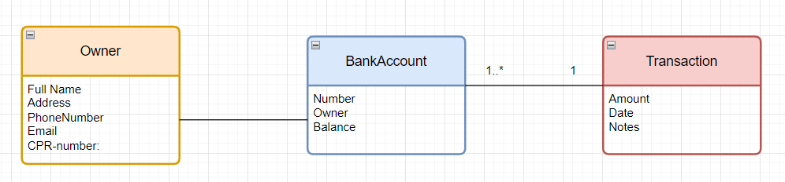

# Uge 39 - Udviklingsproces samt domæne modellering

### [Øvelse 14 - Udviklingsprocessen og Software sikkerhedens 3 søjler](https://24e-its-software-sikkerhed-ucl-pba-its-16896c745213acc3eaef8347.gitlab.io/exercises/14_Gruppe_%C3%B8velse_Software_sikkerhedens_tre_s%C3%B8jler/)

Formålet med denne øvelse er at lave en opsamling på de 4 emner: Systemmål, Sikkerhedsmål, risikovurdering samt trusselsmodellering, og at knytte disse til software sikkerhedens 3 søjler.

#### Spørgsmål og Svar

1. Selvom vi ikke eksplicit har talt om risikostyring i undervisningen, er det stadig en integreret del af udviklingsprocessen. Hvad kan være årsagen til dette?  
>    * Et godt fundament for udvikling, da det tager udgangspunkt i en aftale med udviklingsteam.  
>    * Risikostyring er en del af søjlen “Anvendt Risikostyring” og behandles med udarbejdelse af sikkerhedsmål og trusselsmodellering.  
>    * Selvom risikostyring ikke altid bliver direkte adresseret, er det en nødvendighed i softwareudvikling for at sikre, at systemer bliver robuste over for trusler og sårbarheder. Risikovurdering sikrer, at vi kan identificere, prioritere og afhjælpe risici, som opstår under udviklingens forskellige faser.  

2. Hvordan håndteres risikostyring både forretningsmæssigt og teknisk i praksis med de metoder, I har lært, som f.eks. trusselsmodellering eller risikovurdering?  
>   * Overholdelse af ISO 27000 standard på forretningsmæssigt niveau.
>   * Anvendelse af STRIDE-modellen i trusselsmodelleringen. (teknisk).
>   * Risikoanalyse.

3. Hvilken ISO-standard kan anvendes til at støtte op omkring Anvendt risikostyring, og hvordan kan denne standard bidrage til en mere effektiv risikostyring i softwareudvikling?  
>   * ISO 27005.
>   * Fundament for videre aftale om procedure/protokoller for risikostyring i en virksomhed. 
>   * En mere ensartet procedure for softwareudvikling.  

4. Hvordan fremmer brugstilfælde og misbrugstilfælde vidensdeling blandt teammedlemmer, og hvorfor er dette vigtigt for sikkerheden?  
>   * Det at man arbejder med brugs- og misbrugstilfælde, vækker opsigt på sikkerheden og vidensdeling opstår nemmere.
>   * Giver perspektiv på ondsindede aktører.
>   * Giver en high level-forståelse af systemet, på tværs af teamet.
>   * Dækker både fokusområdet high level design på designmæssigt plan, udviklingsmæssigt og sikkerhedsmæssigt (FURPS).

5. Hvordan kan standarder og awareness-lister hjælpe med at styrke vidensdeling i et udviklingsteam, og hvilke eksempler på awareness-lister kan være nyttige?
>   * Ved at studere listerne kan man være up-to-date på de hyppigst forekomne trusler.
>   * Standarder sikrer en nogenlunde ensrettet måde at arbejde på i teamet.
>   * OWASP Top 10 lister og ASVS standarden.
>   * Med en kombination af erfaring og viden forøges kompetencer.

6. Trusselsmodellering er en central metode til både at indsamle sikkerhedskrav og analysere arkitekturens risiko. Hvordan understøtter trusselsmodellering begge disse aktiviteter i henhold til de 7 berøringspunkter?  
>   * Punkt 3: Sikkerhedskrav bliver udledt fra systemets sikkerhedsmål.
>   * Punkt 4: Risikoanalyse af arkitektur.

7. I faget webapplikations sikkerhed fokuserer vi meget på et af de 7 berøringspunkter. Kan I identificere hvilket, og hvorfor det er særligt relevant i faget webapplikations sikkerhed?  
>   * Penetration Testing
>   * At teste forskellige angrebs vektorer på angrebs overflader.

---

### [Øvelse 16 - Domænemodellering](https://24e-its-software-sikkerhed-ucl-pba-its-16896c745213acc3eaef8347.gitlab.io/exercises/16_Gruppe_%C3%B8velse_dom%C3%A6ne_modellering/)

I denne øvelse skal I udarbejde en domænemodel til applikationen, I lavede i opgaven 36 - grundlæggende OOP med C#.

