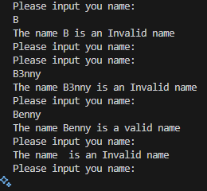
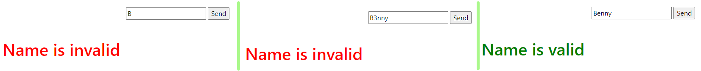
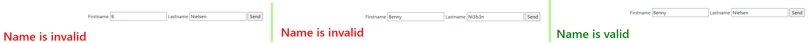
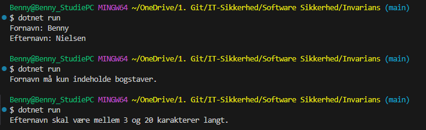
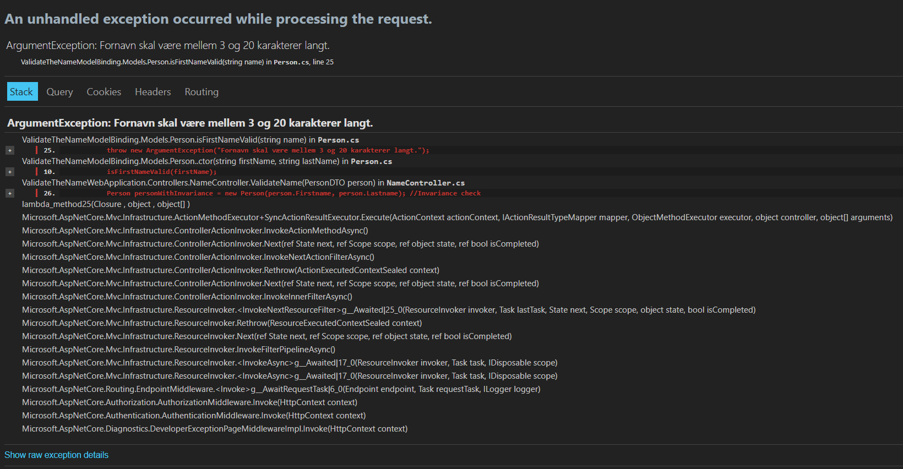

# Uge 40 - Input validering & Sikker kode konstruktion

**Reflektionspunkter efter forberedelsen og inden undervisningen:**

- Hvordan håndhæves precondition i eksemplet vist i bogens _listing 4.7?_
> Med "if statements"
- Hvordan kan invarians håndhæves ved brug af constructor?  (listing 4.9)
> Ved hjælp af et non-null check.
- Hvad menes der med fail fast?
>	Det betyder at stoppe et program eller en funktion så hurtigt som muligt. I stedet for at lade programmet fortsætte og skabe flere problemer, opdager og håndterer man fejlen tidligt for at undgå større problemer senere.  
- Hvad er de 5 valideringspunkter?
>	1. **Tjek oprindelse** – Man sikrer, at data kommer fra en legitim kilde.
>	2. **Tjek størrelsen** – Man sikrer, at data har en passende størrelse.
>	3. **Tjek lexical content** – Man kontrollerer, om data indeholder de forventede karakterer og encoding.
>	4. **Tjek syntax** – Man sikrer, at data har korrekt format og struktur.
>	5. **Tjek semantikken** – Man tjekker, om data giver mening i forhold til systemets domæne eller regler.

---

### [Øvelse 17 - Introduktion til regex i C#](https://24e-its-software-sikkerhed-ucl-pba-its-16896c745213acc3eaef8347.gitlab.io/exercises/17_Grundl%C3%A6ggendeAnvendelseAfRegexICSharp/)

Gennem en tutorial arbejdes der med simple Regex udtryk til at tjekke indholdet af en sætning.  
Et Regex udtryk beskriver et mønster til matchning. Hvis man fx vil matche et enkelt ciffer, bruges følgende mønster: `\d`
For at bruge dette Regex i C# til matchning, skal man anvende Regex-klassen, ved at importere `System.Text.RegularExpressions`namespace i programmet:

I første eksempel anvendes "IsMatch()" metoden, der kontrollere om "pattern" matcher "message", og returnere True eller False:

```C#
using System.Text.RegularExpressions;
using static System.Console;


var message = "I have 5 apples";
var pattern = @"\d";

var result = Regex.IsMatch(message, pattern);

WriteLine(result);
```

I det næste eksempel, anvendes "Match()" metoden. Den returnere den første værdi som matcher udtrykket:

```C#
using System.Text.RegularExpressions;
using static System.Console;


var message = "I have 3 apples and 5 oranges";
var pattern = @"\d";

var match = Regex.Match(message, pattern);
WriteLine(match);
```

Det sidste eksempel bruger "Matches()" metoden. Her returneres alle værdier som matcher udtrykket.  
I dette tilfælde 3 og 5:

```C#
using System.Text.RegularExpressions;
using static System.Console;


var message = "I have 3 apples and 5 oranges";
var pattern = @"\d";

var matches = Regex.Matches(message, pattern);

foreach (var match in matches)
{
    Console.WriteLine(match);
}
```

---

### [Øvelse 18 - Inputvalidering til konsolapplikation](https://24e-its-software-sikkerhed-ucl-pba-its-16896c745213acc3eaef8347.gitlab.io/exercises/18_InputValideringKonsolApplikation/)

I denne opøvelse klones repositoriet [InputValidationsBasicExercises.](https://github.com/mesn1985/InputValidationsBasicExercises)  
Øvelsen omhandler konsolprojektet "ValidateTheName", hvor der skal implementeres valideringslogik i den eksisterende kode.  
Logikken skal følge valideringspunkterne fra "Secure By Design". Det vil altså sige at inden man anvender Regex til at detektere et mønster i inputtet, skal man først kontrollere længden af tekststrengen.

Først tilføjes namespacet `System.Text.RegularExpressions`, så Regex metoderne kan anvendes.   
Derefter tilføjes følgende inputvalidering til den eksisterende kode:  
```C#
        static bool nameInputIsvalid(string? nameInput)
        {
            // Kontrollér at inputtet ikke er tomt og har en længde mellem 3 og 20 tegn.
            if (string.IsNullOrEmpty(nameInput) || nameInput.Length < 3 || nameInput.Length > 20)
            {
                return false;
            }

            // Brug Regex til at sikre, at navnet kun indeholder bogstaver (A-Z og a-z).
            Regex namePattern = new Regex("^[a-zA-Z]+$");

            return namePattern.IsMatch(nameInput);
        }
```
I billedet herunder kan man se at valideringen virker. Den afviser navne med mindre end tre karakterer og acceptere ikke tal i navnet:  


---

### [Øvelse 19 - Inputvalidering i en webapplikation](https://24e-its-software-sikkerhed-ucl-pba-its-16896c745213acc3eaef8347.gitlab.io/exercises/19_Input_validering_med_post_form/#instruktioner)

*Formålet med denne øvelse er at repetere inputvalidering og Regex, samt at forvise én ud af to tilgange til inputvalidering i webapplikationer. I denne øvelse anvendes manuelt implementeret inputvalidering.*  
*Fremgangsmåden i denne øvelse er den samme som i øvelse 18. Denne gang er det dog ikke en konsolapplikation, der skal anvende inputvalidering, men en webapplikation. Projektet, der skal anvendes, er "ValidateTheNameWebApplication". I øvelsen skal du implementere valideringslogik i metoden NameIsValid i controllerklassen NameController.cs.*

Det er altså samme inputvalidering som i opgave 18, som denne gang tilføjes filen NameController.cs:

```C#
        private Boolean NameIsValid(string name){
            // Først kontrollerer vi, om navnet er mellem 3 og 20 tegn langt.
            if (string.IsNullOrEmpty(name) || name.Length < 3 || name.Length > 20)
            {
                return false;
            }

            // Brug Regex til at sikre, at navnet kun indeholder bogstaver (A-Z og a-z).
            Regex namePattern = new Regex("^[a-zA-Z]+$");

            return namePattern.IsMatch(name);
        }
        
```

Her kan man se at inputvalideringen virker:  



---

### Øvelse 20 - [Inputvalidering med model binding & C# attributter](https://24e-its-software-sikkerhed-ucl-pba-its-16896c745213acc3eaef8347.gitlab.io/exercises/20_Input_validering_og_model_binding/#instruktioner)

*Formålet med denne øvelse er at stifte bekendtskab med model binding og validering ved hjælp af denne tilgang. Model binding er, når rammeværktøjet (ASP.NET Core) automatisk mapper modtaget data til en bestemt datatype. I øvelsen skal projektet ValidationModelBinding bruges.* 

Hvor vi tidligere tilføjede valideringslogikken direkte i NameController, bruger metoden "ValidateName" nu et stykke kode, som eksekverer validering (!ModelState.IsValid). Denne kode evaluerer, om objektet, der gives som argument, overholder nogle opsatte regler for lige netop dette objekt. "ValidateName" modtager klassen "PersonDTO.cs" som argument, og det er altså her at inputvalideringen finder sted. 

Valideringen sker ved hjælp af de attributter der anvendes i PersonDTO klassen.  
**[ NotNull ]** er givet i det udleverede kode, og opgaven er så at tilføje flere attributter til klassen, så den samme inputvalidering, som i de andre øvelser opnås.

**[ StringLength ]** og **[ RegularExpression ]** kan anvendes, som angivet i koden herunder:

```C#
using System.ComponentModel.DataAnnotations;
using System.Diagnostics.CodeAnalysis;

namespace ValidateTheNameModelBinding.Models
{
    public class PersonDTO
    {
        [NotNull]
        [StringLength(20, MinimumLength = 3, ErrorMessage = "Firstname must be between 3 and 20 characters.")]
        [RegularExpression("^[a-zA-Z]+$", ErrorMessage = "Firstname can only contain letters.")]
        public string Firstname { get; set; }
        [NotNull]
        [StringLength(20, MinimumLength = 3, ErrorMessage = "Lastname must be between 3 and 20 characters.")]
        [RegularExpression("^[a-zA-Z]+$", ErrorMessage = "Lastname can only contain letters.")]
        public string Lastname { get; set; }
    }
}

```
Inputvalideringen virker:  



---

### [Øvelse 21 - Exceptions i C](https://24e-its-software-sikkerhed-ucl-pba-its-16896c745213acc3eaef8347.gitlab.io/exercises/21_Throwing_Exceptions_In_CSharp/)

Gennem denne [Tutorial](https://www.csharptutorial.net/csharp-tutorial/csharp-throw-exception/), introduceres vi til brugen af Exceptions i C#.  
Formålet med exceptions er at håndtere fejl i et program. Med "throw" kan man rejse en undtagelse (exception), når en bestemt betingelse opfyldes.

I følgende kodeeksempel, indtaster brugeren radius for en cirkel, og programmet returnere cirklens areal.  
Da det ikke er muligt at beregne arealet for en cirkel med en radius på 0 eller lavere, anvendes en **"ArgumentOutOfRangeException"**, hvis sådan et input modtages.

```C#
using static System.Console;

public class Circle
{
    public double Radius
    {
        get; set;
    }
    public Circle(double radius) // konstruktør til at initialisere radius
    {
        if (radius <= 0) // hvis radius er mindre end eller lig med 0, så kastes en exception
        {
            throw new ArgumentOutOfRangeException(  // kaster en exception
                 nameof(radius),                    // navnet på argumentet
                "The radius should be positive"     // besked til exception
             );
        }
        Radius = radius; // hvis radius er større end 0, så sættes radius til den indtastede værdi
    }
    public double GetArea() => Math.PI * Radius * Radius; // udregningen for arealet - PI * r^2

}

class Program
{
    public static void Main(string[] args)
    {
        WriteLine("Enter a radius:"); 
        var input = ReadLine();         // læser input fra brugeren
        if (input != null)            // hvis input ikke er null
        {
            var radius = double.Parse(input);       // konverterer input til en double
            try
            {
                var circle = new Circle(radius);    // opretter et nyt objekt af klassen Circle    
                WriteLine($"The area is {circle.GetArea():F2}");                                
            }
            catch (ArgumentOutOfRangeException ex)  // håndterer exception
            {
                WriteLine(ex.Message);              // udskriver exception beskeden
            }

        }
    }
}

```

---

### [Øvelse 22 - Opretholdelse af invarians med konstruktøren](https://24e-its-software-sikkerhed-ucl-pba-its-16896c745213acc3eaef8347.gitlab.io/exercises/22_Basic_invariant_upholding_in_constructor/)

Formålet med denne øvelse er at give en grundlæggende introduktion til håndhævelse af invarians gennem konstruktøren.

Ved at definere regler for, hvilken data et objekt må indeholde, og sikre sig, at objekter ikke kan oprettes uden at overholde disse regler (håndhævelse af invarians), kan andre dele af softwaren altid stole på, at objektet overholder de regler, som er gældende inden for et enkelt domæne. Man sikrer sig altså, at objekter, der eksisterer i softwaren, opretholder sin integritet.

Opgaven består i at oprette en konsolapplikation der validere et For- og Efternavn i konstruktøren for en "Person" klasse. Reglerne for validering er de samme som i de tidligere opgaver. Da jeg ikke kan skrive C# fra bunden, bruger jeg ChatGPT til at komme frem til følgende kode:

**`Person.cs`**
```C#
using System;
using System.Text.RegularExpressions;

public class Person
{
    private string firstname;
    private string lastname;

    public Person(string firstname, string lastname) // Fornavn og efternavn køres gennem ValidateName metoden.
    {
        this.firstname = ValidateName(firstname, "Fornavn");
        this.lastname = ValidateName(lastname, "Efternavn");
    }

    private string ValidateName(string name, string fieldName) // Validerer navne.
    {
        if (string.IsNullOrWhiteSpace(name)) // Hvis navnet er tomt, kastes en ArgumentException.
        {
            throw new ArgumentException($"{fieldName} kan ikke være tomt.");
        }

        if (name.Length < 3 || name.Length > 20) // Hvis navnet er mindre end 3 eller større end 20 karakterer, kastes en ArgumentException.
        {
            throw new ArgumentException($"{fieldName} skal være mellem 3 og 20 karakterer langt.");
        }

        if (!Regex.IsMatch(name, @"^[a-zA-Z]+$")) // Hvis navnet indeholder andet end bogstaver, kastes en ArgumentException.
        {
            throw new ArgumentException($"{fieldName} må kun indeholde bogstaver.");
        }

        return name; // Returnerer navnet, hvis det er godkendt.
    }

    public string GetFirstName() // Returnerer fornavn.
    {
        return firstname;
    }

    public string GetLastName() // Returnerer efternavn.
    {
        return lastname;
    }
}

```
Klassen person.cs håndtere valideringen i metoden "ValidateName". Da reglerne for validering er de samme for både for- og efternavn, deler de metoden. 

**`Program.cs`**
```C#
class Program
{
    static void Main(string[] args) // Kører programmet.
    {
        try
        {
            Person person = new Person("Benny", "Nielsen");             // Opretter en ny person med fornavn og efternavn.
            Console.WriteLine($"Fornavn: {person.GetFirstName()}");     // Udskriver fornavn.
            Console.WriteLine($"Efternavn: {person.GetLastName()}");    // Udskriver efternavn.
        }
        catch (ArgumentException ex) // Hvis der opstår en ArgumentException, udskrives fejlmeddelelsen.
        {
            Console.WriteLine(ex.Message); // Udskriver fejlmeddelelsen.
        }
    }
}

```
Værdierne for for- og efternavn indtastes i program.cs, hvorefter programmet kan afprøves.  
Som billedet herunder viser, så modtages en fejlmeddelese hvis ikke inputtet lever op til den ønskede validering.



---

### [Øvelse 23 - Opretholdelse af objekters integritet med invarians i webapplikationer](https://24e-its-software-sikkerhed-ucl-pba-its-16896c745213acc3eaef8347.gitlab.io/exercises/23_Usage_of_Invariant_objects_in_web_applications/)

Formålet med denne øvelse er at vise, hvordan objekter, der håndhæver deres invarians gennem en konstruktør, kan anvendes i en webapplikation til at sikre sikkerhed i flere lag.

Når data gives videre mellem klasser i en applikation, gives det videre som et objekt der opretholder invarians og derfor har integritet.  
Men data der modtages fra andre systemer eller fra et andet lag i en applikation, modtages som et såkaldt "Data Transfer Object" (DTO).

!!! info "ChatGPT forklarer hvad en DTO er:"

    En DTO er primært designet til at transportere data fra ét sted til et andet. Dens opgave er simpelthen at bære data uden at udføre nogen behandling eller logik. DTO'er bruges ofte, når data skal sendes mellem forskellige systemer, såsom fra en server til en klient i en webapplikation eller mellem forskellige dele af en applikation (f.eks. fra et database-lag til et brugergrænseflade-lag).

I øvelsen bliver vi bedt om at inspicere metoden `ValidateName` i filen `NameController.cs`, og svare på hvorfor der oprettes et nyt objekt med værdierne fra DTO-objektet `Person`. Svaret er, at det gør der, for at sikre valideringen af data iht. til reglerne i vores domæne, da vi ikke kan stole på at det er udført i en DTO.

Valideringsreglerne fra tidligere implementeres nu i klassen **`person.cs`:**

```C#
namespace ValidateTheNameModelBinding.Models
{
    public class Person
    {
        private string firstName;
        private string lastName;

        public Person(string firstName, string lastName)      // Konstruktør for Person klassen
        {
            isFirstNameValid(firstName);
            isLastNameValid(lastName);

            this.firstName = firstName; 
            this.lastName = lastName;
        }

        private void isFirstNameValid(string name)            // Metode for inputvalidering af fornavn
        {
            if (string.IsNullOrWhiteSpace(name))
        {
            throw new ArgumentException("Fornavn kan ikke være tomt.");
        }
        if (name.Length < 3 || name.Length > 20)
        {
            throw new ArgumentException("Fornavn skal være mellem 3 og 20 karakterer langt.");
        }
        if (!System.Text.RegularExpressions.Regex.IsMatch(name, @"^[a-zA-Z]+$"))
        {
            throw new ArgumentException("Fornavn må kun indeholde bogstaver.");
        }
        }
        private void isLastNameValid(string name)             // Metode for inputvalidering af efternavn
        {
            if (string.IsNullOrWhiteSpace(name))
        {
            throw new ArgumentException("Efternavn kan ikke være tomt.");
        }
        if (name.Length < 3 || name.Length > 20)
        {
            throw new ArgumentException("Efternavn skal være mellem 3 og 20 karakterer langt.");
        }
        if (!System.Text.RegularExpressions.Regex.IsMatch(name, @"^[a-zA-Z]+$"))
        {
            throw new ArgumentException("Efternavn må kun indeholde bogstaver.");
        }
        }
    }
}
```
Programmet kan nu køres og afprøves. Gyldige inputs resultere i "Name is Valid" og hvis der ikke udfyldes noget (Null), returneres "Name is invalid".  
Men hvis man fx indtaster 21 karakterer, resulterer det i en fejl af typen "ArgumentException".  

Man bryder reglen i `isFirstNameValid`, som håndhæver en invariant. Da reglen brydes, kastes en ArgumentException, og fordi der ikke er en try-catch-blok til at fange fejlen, bliver den betragtet som en "unhandled exception", og applikationen viser en fejlside i form af en stack trace, som må siges at være en Excessive Data Exposure sårbarhed.

