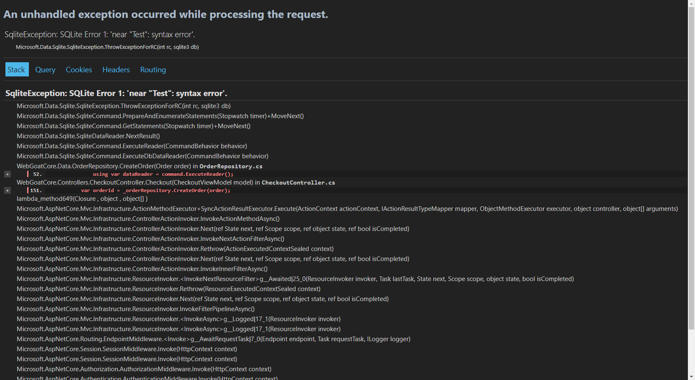
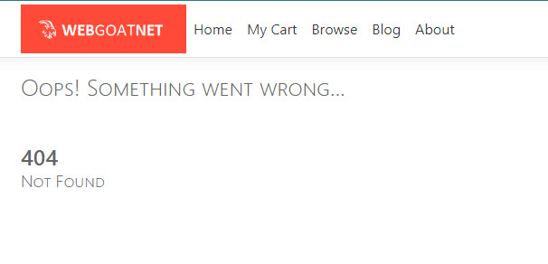
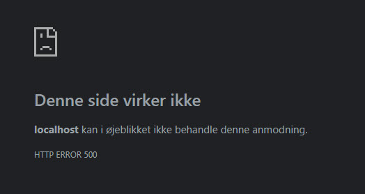

# Uge 43 - Fejlhåndtering i software og taint analyse

**Reflektions punkter efter forberedelsen og inden undervisningen:**

* Hvorfor kan anvendelsen af exception være en fordel?
>Exceptions giver struktureret fejlhåndtering og kan isoleres til specifikke fejlscenarier, hvilket gør koden lettere at læse og vedligeholde.

* Hvad er forskellen på en teknisk exception og en forretnings exception?
>Teknisk exception er systemfejl (f.eks. databasefejl), mens en forretnings exception er en fejl i domænets logik (f.eks. overtrædelse af forretningsregler).

* Hvad er forskellen på at anvende exception eller result objects ved fejlhåndtering?
>Exceptions afbryder koden og håndteres via try-catch, mens result objects returnerer succes eller fejl uden afbrydelse og giver eksplicit fejlhåndtering.

* Exceptions (og dertilhørende stacktrace) kan være en angrebsvektor, hvis disse fremvises til f.eks. slutbrugere. Hvorfor?
>Stacktraces afslører interne systemdetaljer, som angribere kan udnytte til at finde sårbarheder.

* Hvad er en taint analyse?
>Taint-analyse sporer usikker input gennem systemet og forhindrer, at den bruges på farlige måder, indtil den er valideret.

---

### [Øvelse 33 - Exception som angrebsvektor](https://24e-its-software-sikkerhed-ucl-pba-its-16896c745213acc3eaef8347.gitlab.io/exercises/33_Exception_As_an_Attack_Vector/)

Formålet med denne øvelse er at introducere faren ved manglende håndtering af exceptions i ASP.NET Core MVC-applikationer.  
Når en exception bliver kastet i en webapplikation, er det vigtigt, at den aldrig bliver synlig for slutbrugeren (eller andre). En exception indeholder typisk det, der kaldes en stack trace, som viser hvilken kode, der kastede exceptionen, samt hele kæden af metodekald, der førte til kaldet af metoden, som kastede en exception.

Projektet, du skal arbejde med, og klone, er [WebGoat](https://github.com/tobyash86/WebGoat.NET).
Start applikationen og følg punkterne herunder for at vise et eksempel på dårlig exception håndtering:

**Fremprovoker en SQL Exception**
1. Læg nogle varer i indkøbskurven.
2. Gå til checkout.
3. Udfyld alle felter i checkout. Men i feltet Name to ship to skal du tilføje karakteren '.
4. Klik Place order.

**Ovenstående resulterer i denne Stacktrace**



### [Øvelse 34 - Håndtering af exceptions i ASP.NET Core Applikationer](https://24e-its-software-sikkerhed-ucl-pba-its-16896c745213acc3eaef8347.gitlab.io/exercises/34_Handling_Exceptions_globally/#fremprovoker-en-sql-exception)

I denne øvelse ser vi nærmere på overordnet håndtering af exceptions.  

I et produktionsmiljø anvender man en tilgang som ofte refereres til som Global exception handling. Dette betyder, at alle exceptions, som ikke bliver grebet (f.eks. med en try/catch statement), altid vil blive håndteret af en generisk exception handler, der typisk returnerer en generisk fejl tilbage til slutbrugeren (f.eks. HTTP statuskode 500 i webapplikationer).  Det er vigtigt at understrege, at global fejl-håndtering er en sidste "nød-bremse" i tilfælde af uforudsete fejl, der ikke bliver håndteret af applikationen

I WebGoat applikationen er der implementeret en global håndtering af exceptions. Dette kan ses i metoden "Configure" i "Startup"-klassen:

```C#
if (env.IsDevelopment())
{
    app.UseDeveloperExceptionPage();
}
else
{
    app.UseExceptionHandler($"/{StatusCodeController.NAME}?code=500");
}
```
I forrige opgave kunne en stacktrace fremprovokeres da applikationen eksekverer i et udviklingsmiljø. (`env.IsDevelopment()`).
Dette giver god mening, da man i et udviklingsmiljø netop ønsker at modtage så meget information som muligt, i forbindelse med fejlfinding.  
Men det er vigtigt at huske at ændre miljøvariablen, når en applikation overgår fra udvikling til produktion.

Opgaven er nu at udkommentere kodeafsnittet herover og erstatte det med følgende Global Exception Handler:  
`app.UseExceptionHandler($"/{StatusCodeController.NAME}?code=500");`

Herefter genereres samme fejl som i forrige øvelse, hvilket nu resulterer i følgende fejl, fremfor en stacktrace:



Hvis man udkommenterer begge exception handlers, resulterer det i følgende fejlmeddelelse:



Det skyldes at ASP.NET Core understøtter princippet om Secure by default. Dette betyder, at hvis en uhåndteret fejl opstår uden at blive grebet (ej heller af global exception handling), så bliver statuskoden 500 sendt tilbage til klienten.

### [Øvelse 30 - Grundlæggende taint-analyse med Snyk](https://24e-its-software-sikkerhed-ucl-pba-its-16896c745213acc3eaef8347.gitlab.io/exercises/30_Static_code_analysis_With_snyk/)

I denne opgave klones dette [repository.](https://github.com/brunobritodev/ASP.NET-Core-SQL-Injection-Example.)
Med værktøjet Snyk, køres en taint-analyse af koden.

Taint-analysen udføres ved, at en algoritme følger en inputværdi fra kilden (source) til dens endelige mål (sink).
I applikationen er source browserens input til applikationen, som ses i metoden public async Task<IActionResult> SearchStudentUnsecure(string name).
Source må altså være argumentet name. Sink i applikationen er databasen, hvilket også kan ses i koden for metoden SearchStudentUnsecure:

```C#
var conn = _context.Database.GetDbConnection();
var query = "SELECT FirstName, LastName FROM Student WHERE FirstName LIKE '%" + name + "%'";
IEnumerable<Student> students;

try
{
    await conn.OpenAsync();
    students = await conn.QueryAsync<Student>(query);
}
```

Kodelinjen await conn.QueryAsync<Student>(query) laver et kald til databasen med en SQL-string, som indeholder ikke-valideret data. Det vil sige, at tainted data nu får lov til at bevæge sig direkte fra source til sink.

Snyk køres fra mappen "SqlInjection" og returnerer følgende: 

```
Testing C:\Users\benzd\OneDrive\1. Git\IT-Sikkerhed\Software Sikkerhed\ASP.NET-Core-SQL-Injection-Example\SqlInjection ...

 ✗ [Low] Anti-forgery token validation disabled
     Path: Controllers/HomeController.cs, line 63
     Info: This ASP.NET MVC action should use an anti-forgery validation attribute. Not using this attribute disables Cross Site Request Forgery (CSRF) protection and allows CSRF attacks.

 ✗ [Low] Use of Hardcoded Credentials
     Path: Database/DbInitializer.cs, line 27
     Info: Do not hardcode credentials in code. Found hardcoded credential used in username variable declaration.

 ✗ [Low] Use of Hardcoded Credentials
     Path: Database/DbInitializer.cs, line 28
     Info: Do not hardcode credentials in code. Found hardcoded credential used in username variable declaration.

 ✗ [Low] Use of Hardcoded Credentials
     Path: Database/DbInitializer.cs, line 29
     Info: Do not hardcode credentials in code. Found hardcoded credential used in username variable declaration.

 ✗ [Low] Use of Hardcoded Credentials
     Path: Database/DbInitializer.cs, line 30
     Info: Do not hardcode credentials in code. Found hardcoded credential used in username variable declaration.

 ✗ [Low] Use of Hardcoded Credentials
     Path: Database/DbInitializer.cs, line 32
     Info: Do not hardcode credentials in code. Found hardcoded credential used in username variable declaration.

 ✗ [Low] Use of Hardcoded Credentials
     Path: Database/DbInitializer.cs, line 33
     Info: Do not hardcode credentials in code. Found hardcoded credential used in username variable declaration.

 ✗ [Low] Use of Hardcoded Credentials
     Path: Database/DbInitializer.cs, line 34
     Info: Do not hardcode credentials in code. Found hardcoded credential used in username variable declaration.

 ✗ [Low] Use of Hardcoded Credentials
     Path: Database/DbInitializer.cs, line 27
     Info: Do not hardcode credentials in code. Found hardcoded credential used in password variable declaration.

 ✗ [Low] Use of Hardcoded Credentials
     Path: Database/DbInitializer.cs, line 28
     Info: Do not hardcode credentials in code. Found hardcoded credential used in password variable declaration.

 ✗ [High] SQL Injection
     Path: Controllers/HomeController.cs, line 32
     Info: Unsanitized input from an HTTP parameter flows into QueryAsync, where it is used in an SQL query. This may result in an SQL Injection vulnerability.


✔ Test completed

```

Snyk fortæller at der er en mulig SQL injection i linje 32.  
I koden kan man se at det er i linje 32 at kaldet til databasen foretages: `students = await conn.QueryAsync<Student>(query);`

### [Øvelse 31 - Taint-analyse med falsk positiv](https://24e-its-software-sikkerhed-ucl-pba-its-16896c745213acc3eaef8347.gitlab.io/exercises/31_Static_code_analysis_With_snyk_false_positive/)

Nu tilføjes validering til klassen "HomeController" ved at tilføje følgende metode `ValidateName`:  
```C#
        private Boolean ValidateName(string name)
        {
            // Tjek om navnet ikke er tomt, og at det er mellem 3 og 20 tegn langt
            if (string.IsNullOrEmpty(name) || name.Length < 3 || name.Length > 20)
            {
                return false;
            }

            // Regex for at sikre, at navnet kun indeholder alfabetiske karakterer (A-Z, a-z)
            Regex namePattern = new Regex("^[a-zA-Z]+$");
            return namePattern.IsMatch(name);
        }
```

Valideringen tilføjes til metoden `SearchStudentUnsecure`:

```C#
[HttpGet("SearchStudentUnsecure")]
        public async Task<IActionResult> SearchStudentUnsecure(string name)
        {
            // Valider navnet ved hjælp af ValidateName-metoden
            if (!ValidateName(name))
            {
                return BadRequest("Ugyldigt navn. Navnet skal være mellem 3 og 20 alfabetiske tegn.");
            }

            var conn = _context.Database.GetDbConnection();
            var query = "SELECT FirstName, LastName FROM Student WHERE FirstName Like '%" + name + "%'";
            IEnumerable<Student> students;

            try
            {
                await conn.OpenAsync();
                students = await conn.QueryAsync<Student>(query);
            }

            finally
            {
                conn.Close();
            }
            return Ok(students);
        }
```

Nu køres Snyk-værktøjet igen, men på trods af valideringen modtages der stadig en sårbarhed for SQL-Injection:  
```shell
 ✗ [High] SQL Injection
     Path: Controllers/HomeController.cs, line 51
     Info: Unsanitized input from an HTTP parameter flows into QueryAsync, where it is used in an SQL query. This may result in an SQL Injection vulnerability.
```

Inputtet er dermed ikke længere tainted. Men da taint-analyseværktøjet som udgangspunkt ikke har nogen forudsætninger for at vurdere, hvornår data bør betragtes som sikker i en kontekstbestemt situation, vil den stadig betragte data som værende tainted, og derfor reagere. Dette kaldes en falsk positiv. Altså vurderer taint-analysen data som værende forurenet, selvom det ikke er tilfældet.

---
