# Uge 12 - Logning i Linux

## Opgave 12 - Linux log system
Formålet med denne øvelse er at introducere Linux-logsystemet og præsentere de grundlæggende koncepter. Hver Linux-distribution har sine egne variationer i logsystemet, men grundlæggende fungerer de ens. I dette fag arbejdes der med logsystemet på en Ubuntu-server.

#### Logfiler i Ubuntu

Systemets logfiler opbevares i mappen /var/log/. To af de vigtigste logfiler er:

    syslog – Den primære logfil, der indeholder systemets aktiviteter.
    auth.log – Log over autentificering og sikkerhedshændelser.


### Instruktioner

#### Primær logfil: syslog

Den primære logfil for systemet hedder syslog og indeholder information om stort set alt, hvad systemet foretager sig.

Udskriv de seneste 20 linjer af syslog: `tail -n 20 /var/log/syslog`
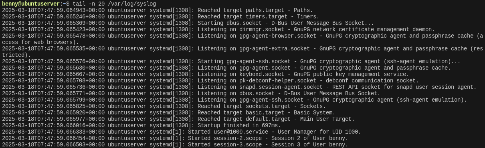

Studér logformatet. En typisk linje i syslog ser sådan ud: `Mar 12 10:15:03 hostname process[1234]: This is a log message`

Identificér følgende elementer:

        Tidsstempel (fx Mar 12 10:15:03)
        Værtsnavn (fx hostname)
        Program/Service (fx process[1234])
        Besked (fx This is a log message)


Find ud af, hvilken tidszone loggen bruger til tidsstempling: `timedatectl`

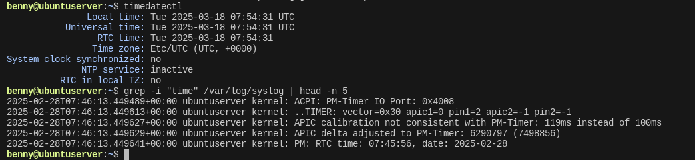

Er systemets tidszone UTC, eller er den lokal? 
> UTC

#### Authentication log: auth.log

Logfilen auth.log indeholder information om autentificering og sikkerhedshændelser.

Udskriv de seneste 20 linjer af auth.log: `tail -n 20 /var/log/auth.log`

Identificér brugerens navn (fx root eller en anden konto).
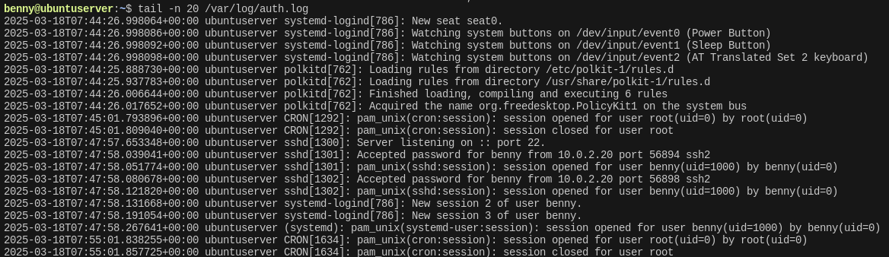

Skift til root og udskriv auth.log igen:

    sudo su
    tail -n 20 /var/log/auth.log

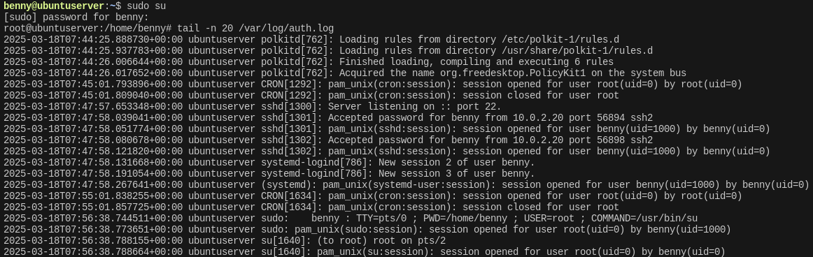

Bemærk, at sudo su muligvis ikke altid efterlader en logpost. Prøv også:

    sudo -i
    exit
    tail -n 20 /var/log/auth.log

Skift tilbage til din primære bruger og udskriv auth.log igen.
    Hvilke nye rækker blev tilføjet?
    Kan du se spor af dit autentificerings-forsøg?

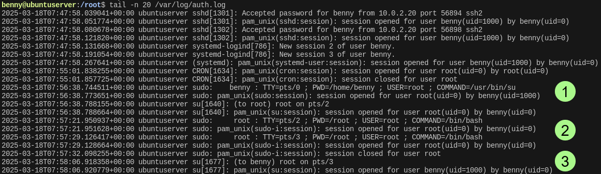

#### Filtrering af logs

I stedet for at udskrive hele logfiler kan du filtrere relevante oplysninger:

Søg efter fejlmeddelelser i syslog: `grep -i "error" /var/log/syslog | tail -n 10`

Find autentificeringsfejl i auth.log: `grep -i "failed" /var/log/auth.log | tail -n 10`

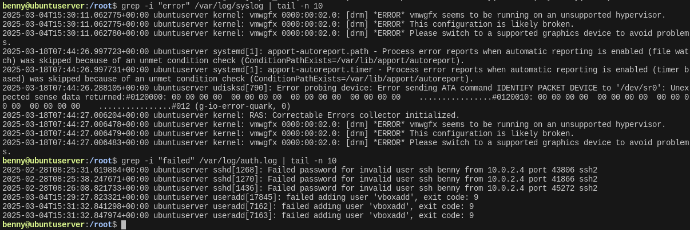

#### Bonusopgave: Find system-genstartere

Søg efter alle system-genstartere i syslog: `grep -i "reboot" /var/log/syslog`

Hvilke tidspunkter genstartede systemet?
Kan du identificere brugeren, der udløste genstarten, baseret på logdata? ved at samholde data fra syslog med authlog `grep -i "sudo" /var/log/auth.log | grep -E "reboot|shutdown"`

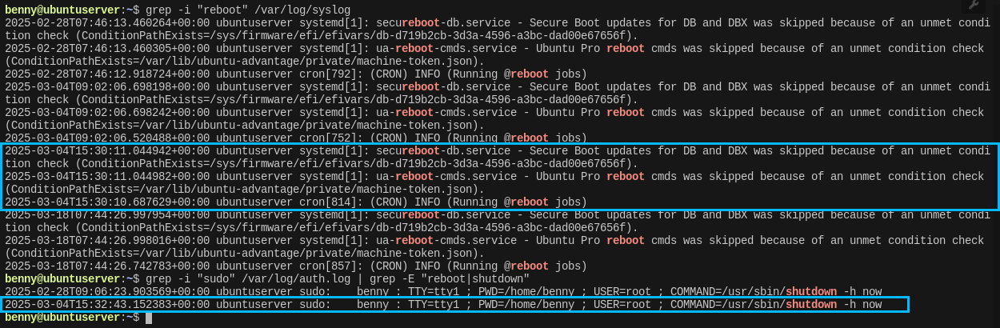


#### Brug af journalctl

Ud over rsyslog kan du også bruge journalctl til at vise logs: - Udskriv de seneste 20 logs fra systemets journal:

`journalctl -n 20`

Filtrér logs for en specifik service, fx SSH:

`journalctl -u ssh --no-pager | tail -n 10`


### Refleksion

Hvad kan du lære om systemets aktivitet ud fra disse logs?
> "syslog" viser generelle aktiviteter og hændelser  
"auth.log" viser autentificeringsforsøg.

Hvorfor er logfiler vigtige for fejlfinding og sikkerhed?
> Uden logfiler bliver det umuligt at dokumentere hvad og hvem der har udført ændringer på et system, hvilket er et problem i forhold til sikkerhed.   
Ved at sammenholde forskellige systemlogs, kan man fejlfinde sig frem til processer og services som skaber problemer.

## Opgave 13 - rsyslog og konfigurationsfiler

Formålet med følgende øvelse er at introducere Standard rsyslog-konfigurationsfilen, hvor konfigurationer for Rsyslog kan ændres.

### Instruktioner

#### Opsætning af locate til søgning

Kommandoen find er god til søgning af filer, men locate kan også med fordel anvendes.

Installer locate med kommandoen: `sudo apt install locate`

Opdater "Files on disk"-databasen: `sudo updatedb`

Bemærk: Locate benytter en database, der ikke opdateres automatisk. Derfor skal du køre sudo updatedb, før nye filer vises i søgeresultaterne.

#### Skab et overblik over Rsyslog-logfilerne på operativsystemet

Brug locate til at finde alle filer med ordet rsyslog: `locate rsyslog`

Skab et generelt overblik over filerne:

Er der mange tilknyttede filer? 
> Ja, over 50.

Kan du se, hvilke mapper de primært befinder sig i?
> Ja, listen af filer starter med path-angivelsen. 

#### Rsyslog-konfigurationsfilen

Rsyslog-konfigurationsfilen indeholder den generelle opsætning af rsyslog-daemonen, herunder hvem der ejer logfilerne, og hvilken gruppe der er tilknyttet logfilerne. Herudover har den en modulopsætning. Moduler er ekstra funktionaliteter, som man kan tilføje til rsyslog.

Brug locate til at finde rsyslog-konfigurationsfilen rsyslog.conf: `locate rsyslog.conf`

Åbn filen med nano. `sudo nano /etc/rsyslog.conf`

Find afsnittet "Set the default permissions for all log files".  
Notér:

    Hvem der er filens ejer.
    Hvilken gruppe logfilerne er tilknyttet.

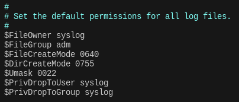

Udforsk de andre områder af filen. Særligt interessante sektioner:  

Moduler (module(load="imudp")) – hvilke moduler er aktiveret?

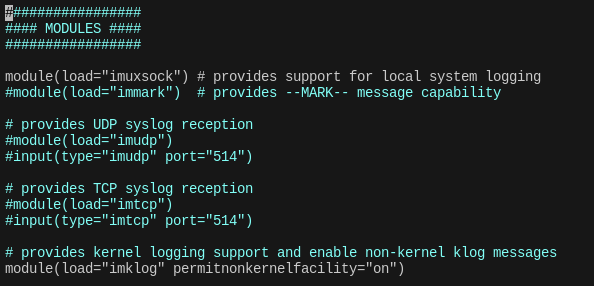

Andre konfigurationer - Hvilken andre konfigurationer kan ændres inde i filen?
> Hvor man gemmer logfilerne

File til regel ændring - Er der information om hvilken file der ændres til at ændre Rsyslog regler?

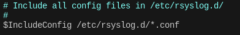

#### Sikkerhed & fejlfinding

Hvorfor er det vigtigt, at kun bestemte brugere har adgang til logfiler?
> Det er vigtigt, at kun bestemte brugere har adgang til logfiler for at:  
    - Beskytte sikkerhed: Forhindre misbrug af følsomme oplysninger.  
    - Sikre integritet: Forhindre uautoriseret ændring af logs.  
    - Bevare privatliv: Beskytte personlige oplysninger.  
    - Overholde compliance: Opfylde sikkerhedsstandarder.

Hvordan kan man beskytte logfiler mod manipulation?
> For at beskytte logfiler mod manipulation, kan man:  
    - Begrænse adgang: Kun tillade autoriserede brugere adgang til logfiler.  
    - Brug centraliseret logning: Send logs til en centraliseret server, der er sikret mod uautoriseret adgang.  
    - Implementer logrotation og arkivering: Roter og arkiver logs regelmæssigt for at bevare historiske data sikkert.  
    - Anvend kryptografi: Brug kryptografiske metoder til at sikre logfilernes integritet.  
    - Overvåg adgang: Log og overvåg adgang til logfiler for at opdage mistænkelig aktivitet.


### Refleksion

Hvorfor er det vigtigt at have korrekte tilladelser på logfilerne? 
> Principle of least privilege. Man bør ikke have adgang til mere end hvad der er nødvendigt for at løse sine opgaver.

Hvordan kan du bruge logs til at overvåge sikkerhedsrelaterede hændelser på systemet?
> Ved at sammenholde logs kan man finde frem til eventuelle ændringer i et system, udført af en trusselsaktør.

## Opgave 14 - Logging regler for rsyslog kan ændres

Formålet med denne øvelse, er at introducer Rsyslog filen 50-default.conf, og hvordan man kan lave ændringer i Rsyslog konfigurationen. Typisk når der laves konfigurations ændringer i RSyslog anvendes denne fil.

Reglerne for, hvad rsyslog skal logge, findes i konfigurationsfilen /etc/rsyslog.d/50-default.conf.

Rsyslog bruges til at styre, hvor systemets logbeskeder gemmes, og hvilke typer beskeder der logges. Dette er afgørende for fejlfinding, overvågning af systemaktivitet og sikkerhedslogging. Ved at ændre konfigurationsreglerne kan man: - Separere logs fra forskellige tjenester for at gøre fejlfinding lettere. - Bestemme logniveauer for at fokusere på relevante beskeder. - Opbevare sikkerhedsrelaterede logs separat for bedre beskyttelse.
Hvorfor ændrer vi ikke direkte i rsyslog.conf?¶

Det er en bedre praksis at håndtere konfigurationer via separate filer i /etc/rsyslog.d/ i stedet for at redigere rsyslog.conf direkte. Der er flere grunde til dette:

    - Modularitet og Overblik – Hver tjeneste eller funktion kan have sin egen konfigurationsfil, hvilket gør det lettere at vedligeholde og fejlfinde.
    
    - Opdateringssikkerhed – rsyslog.conf kan blive overskrevet ved en systemopdatering, mens filer i /etc/rsyslog.d/ forbliver intakte.
    
    - Bedre Fejlhåndtering – Hvis en ændring i en separat fil laver fejl, kan du nemt deaktivere eller rette den uden at påvirke resten af systemet.
    
    - Standardisering – Mange systemer følger best practice ved at holde rsyslog.conf generisk og kun bruge den til at inkludere andre konfigurationsfiler.
    
    - Lettere Rollback & Versionsstyring – Ændringer i separate filer kan nemt testes, rulles tilbage eller deaktiveres uden at påvirke hele logsystemet.

### Instruktioner

#### Find og analyser Rsyslog-konfigurationsfilen

Find filen 50-default.conf i Rsyslog-konfigurationsmappen: `locate 50-default.conf`

Hvis locate ikke finder filen, brug: `find /etc/rsyslog.d/ -name "50-default.conf"`

Åbn filen med: `sudo nano /etc/rsyslog.d/50-default.conf`

Skab et overblik over alle logfiler, som der bliver sendt beskeder til.  
Notér, hvilke filer mail-applikationen sender logbeskeder til, ved prioriteringerne:

        info
        warning
        err

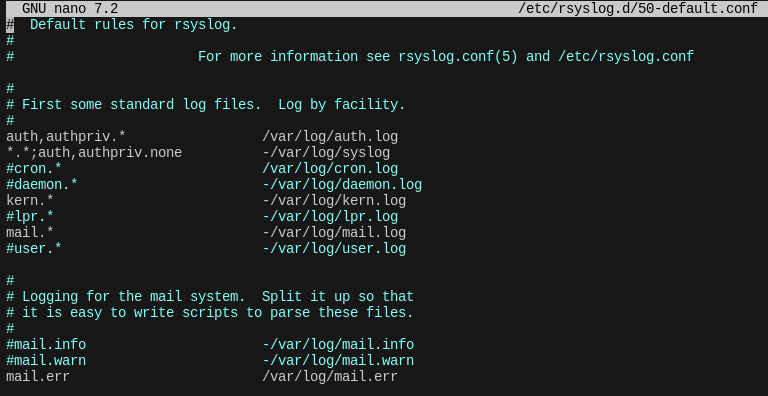

Tip: Brug følgende kommando for hurtigt at finde mail-logregler: `grep "^mail." /etc/rsyslog.d/50-default.conf`

#### Ændring af Rsyslog-konfiguration

For at gøre øvelsen mere praktisk, skal du nu ændre Rsyslog-konfigurationen, så SSH-loginforsøg logges til en separat fil.

Dette kan være nyttigt til sikkerhedsovervågning, da det gør det lettere at opdage uautoriserede loginforsøg.

Opret en ny konfigurationsfil i /etc/rsyslog.d/: `sudo nano /etc/rsyslog.d/50-ssh.conf`

Tilføj følgende linje for at gemme SSH-loginforsøg i en ny logfil `authpriv.*  /var/log/ssh.log`

Bemærk: - Brug authpriv.* i stedet for auth.info, da SSH-autentificeringslogs normalt gemmes under authpriv.
- * betyder, at alle logniveauer (info, notice, warning osv.) inkluderes.

#### Opret logfilen med korrekte tilladelser

```
sudo touch /var/log/ssh.log
sudo chown syslog:adm /var/log/ssh.log
sudo chmod 640 /var/log/ssh.log
```

- chown syslog:adm sikrer, at rsyslog har adgang til at skrive til filen.

#### Sikre, at SSH sender logs til syslog

Åbn SSH-konfigurationsfilen:

sudo nano /etc/ssh/sshd_config

Find (eller tilføj) følgende linje:

SyslogFacility AUTHPRIV

- Dette sikrer, at SSH-logningen sendes til authpriv.

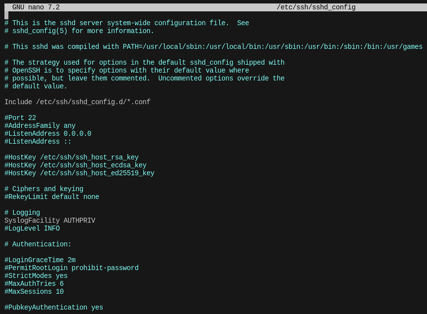

#### Genstart nødvendige tjenester

Efter ændringerne skal vi genstarte rsyslog og ssh:

sudo systemctl restart rsyslog
sudo systemctl restart ssh

#### Test ændringen

Åbn en ny terminal og log ind på serveren via SSH: `ssh brugernavn@server-ip`

Derefter, på serveren, tjek om der er nye logs: `tail -f /var/log/ssh.log`

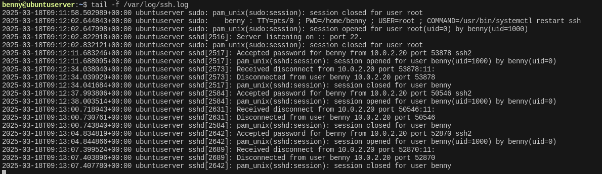

#### Fejlsøgning (hvis logs ikke vises)

    Tjek om rsyslog kører korrekt:

    sudo systemctl status rsyslog

    Valider rsyslog-konfigurationen for fejl:

    sudo rsyslogd -N1

    Test manuelt, om logs kan skrives til filen:

    logger -p authpriv.info "Test SSH logging"
    tail -f /var/log/ssh.log

    Sørg for, at systemet faktisk genererer SSH-logindgange:

    sudo grep sshd /var/log/auth.log | tail -n 10


