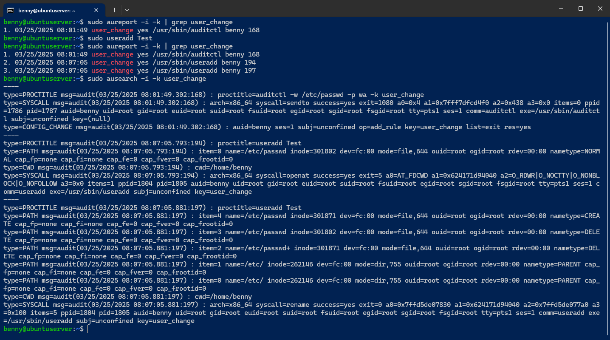
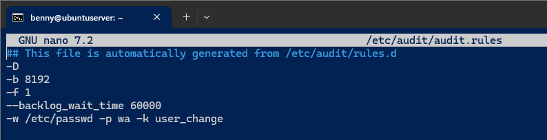
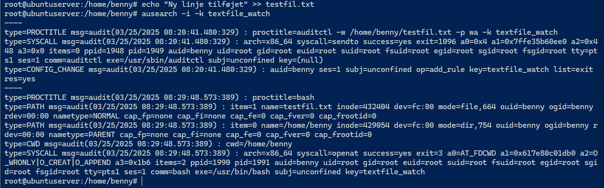
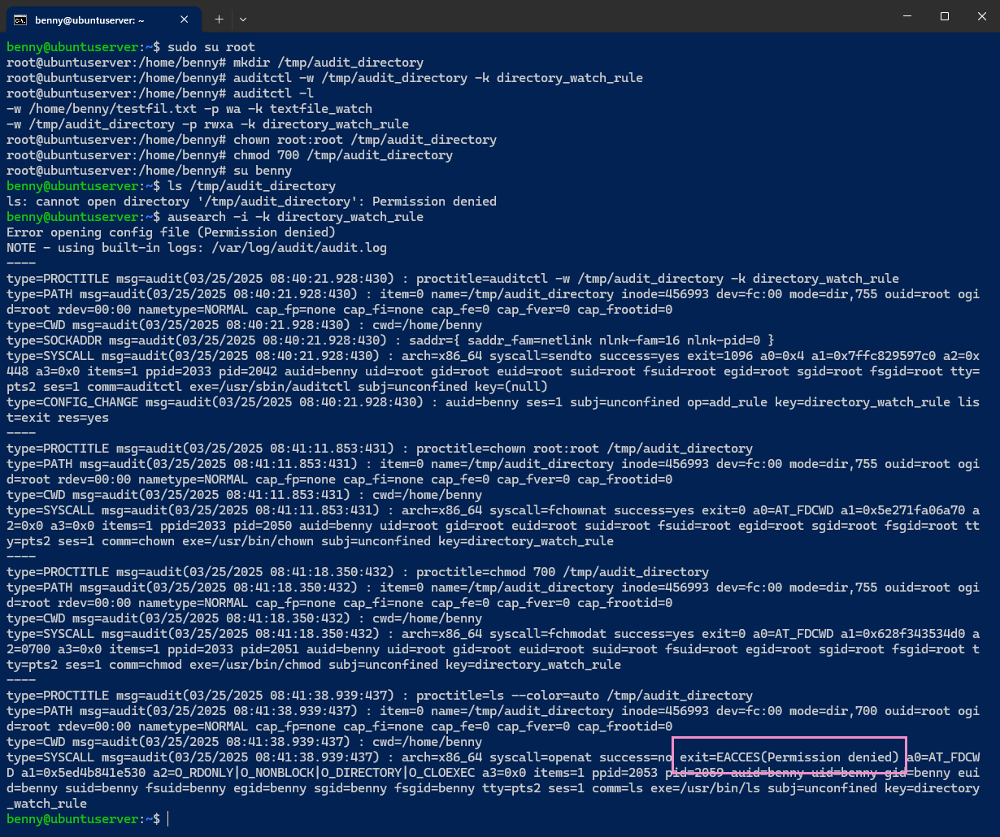
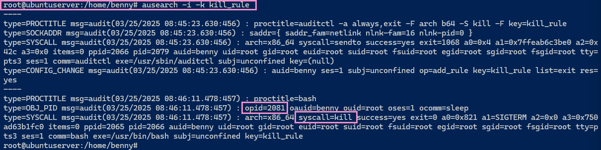

# Uge 13 - Audit & Efterforskningsproces

## Audit Daemon

Når det kommer til sikkerhed og overvågning i Linux, er **auditd** et af de vigtigste værktøjer. Det hjælper administratorer med at overvåge kritiske ændringer i systemet, såsom adgang til filer, ændringer i systemindstillinger og mistænkelige handlinger.

Audit daemon (`auditd`) fungerer som et logningssystem for foruddefinerede begivenheder, kaldet _audit-regler_. Hver gang en regel aktiveres, registreres en hændelse i en _audit-log_ – en slags "alarm", der kan bruges til sikkerhedsanalyse eller fejlretning.

Som udgangspunkt findes alle `auditd`-logs i:  `/var/log/audit/audit.log`

#### 📌 Hvad kan auditd overvåge?

- **Ændringer i filer og mapper** (fx adgang, sletning, ændringer)
- **Hvem der tilgår systemressourcer**
- **Systemkald og procesændringer**
- **Fejl og mislykkede adgangsforsøg**

**Vigtigt!**  
`auditd` er **ikke** et versionsstyringssystem og holder derfor ikke styr på _hvad_ der blev ændret – kun _hvem_ der foretog ændringen.

#### Kommandoer

Udskriv nuværende audit-regler: `sudo auditctl -l`
Udskriv logfilen for at se registrerede begivenheder: `sudo cat /var/log/audit/audit.log`

Logfilen kan være svær at læse. Derfor bruger man typisk to værktøjer til analyse af specifikke begivenheder:

* **ausearch** → Bruges til at søge efter specifikke hændelser
* **aureport** → Giver en overskuelig rapport over logs 

## Opgave 27 - Audit af en fil for ændringer
Formålet med denne øvelse er at give en introduktion til, hvordan audit-regler kan konfigureres med auditd.

For at definere begivenheder, der udløser en audit log, skal man opsætte en auditregel. Dette kan gøres på to måder:
* Dynamisk ved at tilføje reglen via værktøjet auditctl.
* Permanent ved at tilføje reglen i konfigurationsfilen /etc/audit/rules.d/.

I denne øvelse lærer du at opsætte begge typer regler og analysere audit-logs:

Opret en auditregel, der overvåger ændringer og skrivninger til filen /etc/passwd, med kommandoen:  
```auditctl -w /etc/passwd -p wa -k user_change```

Forklaring:
- -w står for "where" og angiver den fil, der skal overvåges.
- -p står for "permissions" og definerer, hvilke handlinger der skal overvåges (wa = write + attribute ændringer).
- -k tildeler en nøgle (key), der gør det lettere at søge efter relaterede hændelser. 

Udskriv en rapport over loggede hændelser med:
```aureport -i -k | grep user_change```

Forklaring:
- -i betyder "interpret" og oversætter numeriske værdier (fx bruger-ID) til læsbare navne.
- -k filtrerer loggen baseret på den tidligere definerede nøgle. 
Rapporten viser hændelser i formatet: Dato/tid, key, succes-status, udførende proces (bruger, process-id osv.).

Nu tilføjes en ny bruger (test) med `useradd`. Dette vil tilføje en ny linje i /etc/passwd, da brugeroplysninger gemmes her.

`sudo ausearch -i -k user_change` giver en detaljeret oversigt over ændringerne.



Auditctl-regler er ikke persistente, hvilket betyder, at de forsvinder ved en genstart. For at gøre reglerne permanente, skal de gemmes i /etc/audit/rules.d/.

```sudo nano /etc/audit/rules.d/```

Denne fil bliver indlæst ved opstart af auditd og indeholder alle aktive audit-regler.
Bemærk: Øverst i filen står der, at den autogenereres ud fra /etc/audit/rules.d/.

Opret en ny fil med den aktuelle auditregel ved at køre:  
```sh -c "auditctl -l > /etc/audit/rules.d/custom.rules"```

Genstart audit-daemon med kommandoen: `sudo systemctl restart auditd`.

Nu kan den nye regel aflæses i /etc/audit/rules.d/:



### Overvågning af en tekstfil

Auditd kan også bruges til at overvåge ændringer i almindelige tekstfiler. Dette kan være nyttigt for at sikre filintegritet og spore, hvem der har foretaget ændringer. 

Opret en fil med noget tekst: `echo "Dette er en testfil" > testfil.txt`

Konfigurer Auditd til at overvåge filen: `auditctl -w /path/to/testfil.txt -p wa -k textfile_watch`

Tilføj noget tekst til filen: `echo "Ny linje tilføjet" >> testfil.txt`

Verificér, at ændringen er blevet registreret i audit-loggen: `ausearch -i -k textfile_watch`



### Refleksioner

Overvej følgende spørgsmål efter at have gennemført øvelsen:

Hvordan kan auditd hjælpe med at opdage uautoriserede ændringer i systemfiler?
> Det kan konfigureres som gennemgået her i hændelsen, på filnevaeu. I næste øvelse gennemgås det på mappeniveau.

Hvilke typer af filer eller systemområder ville være kritiske at overvåge i en produktionsserver?
> Adgang til filer med kritiske data. Enten forretningsmæssige data eller fx. persondata.

Hvordan kan AuditD integreres med F.eks. Wazuh?
> Wazuh kan aflæse audit-loggen, og i Wazuh kan man opsætte regler som reagere på specifikke hændelser.

## Opgave 28 - Audit af et directory

Formålet med denne øvelse er at demonstrere, hvordan auditd kan overvåge et directory.

Directories kan overvåges med auditd på samme måde som filer.

De rettigheder, der kan overvåges, er:
- Read (r) → Når en fil eller directory bliver læst
- Write (w) → Når en fil eller directory bliver ændret
- Attribute (a) → Når filmetadata ændres
- Execute (x) → Når en fil eksekveres, eller nogen forsøger at tilgå directoryet (fx cd /etc/)

Hvis execute (x)-rettigheden overvåges, vil et forsøg på at skifte sti ind i directoryet (fx cd /etc/) udløse en auditlog.

Opret et nyt directory ved at køre: `mkdir /tmp/audit_directory`

Opret en auditregel, der overvåger directoryet, med kommandoen: `auditctl -w /tmp/audit_directory -k directory_watch_rule`
Bemærk, at permissions bevidst er undladt.

Bekræft reglen ved at udskrive audit-reglerne med: `auditctl -l`
Notér, hvilke rettigheder der overvåges. Da -p ikke blev angivet, vil standardrettigheder blive anvendt.

Ændr ejerskabet af directoryet til root, og begræns adgang for andre brugere:

```
chown root:root /tmp/audit_directory
chmod 700 /tmp/audit_directory
```

Test adgangsbegrænsning:
Log ind med en bruger, der ikke er root.

Prøv at køre: `ls /tmp/audit_directory`
Dette burde resultere i en Permission Denied-fejl.

Analyser loggen for directoryet med: `ausearch -i -k directory_watch_rule`



## Opgave 29 - Overvågning af OS API'et for specifikke systemkald

Formålet med denne øvelse er at demonstrere, hvordan auditd kan overvåge systemkald til operativsystemets API.

Operativsystemer tilbyder et sæt systemkald (syscalls), som applikationer bruger til at kommunikere med kernens API. Auditd kan bruges til at registrere, hvilke processer der foretager bestemte systemkald, hvilket gør det muligt at spore handlinger såsom:

* Oprettelse eller afslutning af processer
* Ændringer i filsystemet
* Netværksforbindelser
* Systemændringer og administrative handlinger

I denne øvelse vil vi fokusere på overvågning af processer, der bliver afsluttet, ved at logge kill-systemkaldet

Tilføj en auditregel, der registrerer kill-systemkaldet (som bruges til at afslutte processer), med kommandoen:

```auditctl -a always,exit -F arch=b64 -S kill -F key=kill_rule```

-a always,exit → Overvåg alle afslutninger af systemkald.
-F arch=b64 → Specificerer systemarkitekturen (64-bit i dette tilfælde).
-S kill → Overvåg kill-systemkaldet.

-F key=kill_rule → Tilføjer en nøgle (key), så loggen kan filtreres senere.

Start en baggrundsproces med: `sleep 600 &`
Dette starter en proces, der sover i 600 sekunder (10 minutter).

Find proces-ID'et (PID) for sleep-processen ved at køre: `ps aux | grep sleep`

Afslut processen ved at køre: `kill <proces ID>`

Kør kommandoen: `ausearch -i -k kill_rule`

Dette vil vise: - Hvilken bruger der udførte systemkaldet. - Hvilken proces, der blev afsluttet. - Det præcise tidspunkt for hændelsen.



## Opgave 30 - Checksum af en fil

Formålet med denne øvelse er at forstå, hvordan checksums kan bruges til at verificere data-integritet.

For at sikre integriteten af data benytter man ofte en hashværdi som checksum. Checksums bruges til:

* At verificere filers integritet efter overførsel eller lagring.
* At opdage uautoriserede ændringer i systemfiler.
* At kontrollere, om en fil er identisk med en referenceversion.

En hashfunktion anvendes til at generere en checksum. Hvis blot et enkelt tegn ændres i inputtet til en hashfunktion, bliver outputtet helt anderledes. Derfor er checksums en pålidelig metode til at opdage dataændringer.


Installer hashalot (hvis den ikke allerede er installeret): `sudo apt install hashalot`

Opret en testfil, der indeholder teksten "Hej med dig": `echo "Hej med dig" > testfil.txt`

Lav en checksum af filen ved hjælp af SHA-256 hashfunktionen: `sha256sum testfil.txt`

Notér checksummen: `fc295707963fc6268637153ac4d1e996f2489535c602dfdc2a2ffc4e4afa7e42  testfil.txt`

Lav en ny checksum af filen, og verificér, at den er identisk: `sha256sum testfil.txt`
Checksummen bør være den samme, da filens indhold ikke har ændret sig. `fc295707963fc6268637153ac4d1e996f2489535c602dfdc2a2ffc4e4afa7e42  testfil.txt`

Tilføj et ekstra tegn til teksten i filen: `echo "f" >> testfil.txt`

Generér en ny checksum, og bemærk ændringen: `sha256sum testfil.txt`

Da filens indhold er ændret, vil checksummen nu være helt anderledes.
`cb9898c74ad6aaa1bad75331fb135135f081b2ef4f953c45eb480a910351bf36  testfil.txt`

#### 🔎 Yderligere anvendelser

Checksums bruges bredt i IT-verdenen til: 
- Digitale signaturer og kryptering. 
- Dataintegritet i backup- og gendannelsessystemer. 
- Bekræftelse af softwaredownloads (f.eks. ISO-filer).

For at verificere en fil mod en kendt checksum kan du sammenligne værdien med en officiel kilde: `sha256sum -c checksumfil.txt`

#### 🕵️ Checksum og logfil-integritet

I en efterforskningsproces er det afgørende at sikre, at logfiler ikke er blevet manipuleret. Checksums kan bruges til at: 
- Verificere, at en logfil ikke er blevet ændret mellem indsamling og analyse. 
- Dokumentere, at en bestemt fil er intakt og uændret under en efterforskning. 
- Sikre pålidelighed i retssager eller compliance-audits.

For at anvende checksums på en logfil: `sha256sum /var/log/audit/audit.log > log_checksum.sha256`

For at verificere logfilens integritet senere: `sha256sum -c log_checksum.sha256`

Hvis checksummen matcher, er logfilen uændret. Hvis den ikke gør, kan der være sket manipulation.