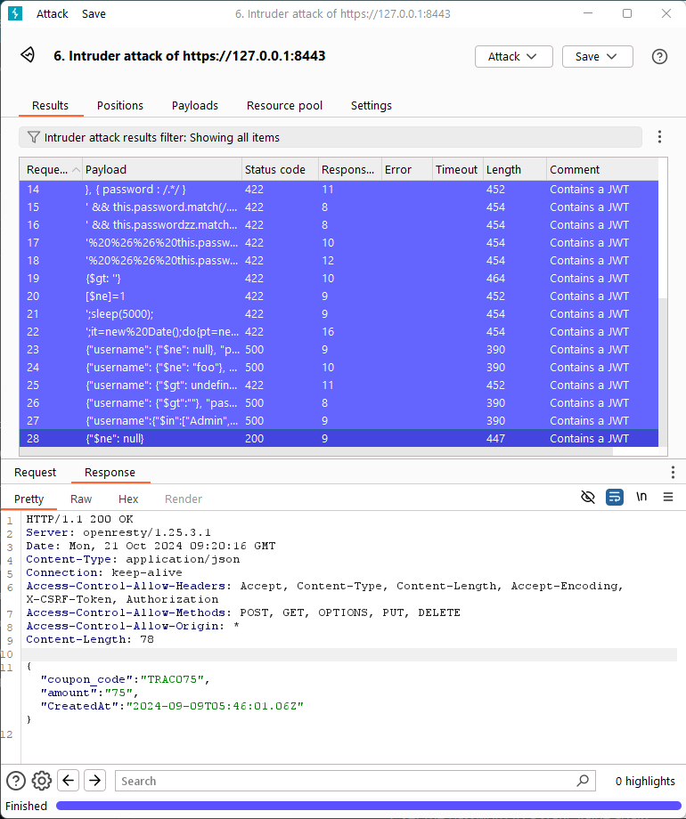

# Uge 43 - Opdage sårbarheder med fuzzing

**Reflektionspunkter efter forberedelsen og inden undervisningen:**

- Hvad er fuzz testing?
  >Softwaretest med tilfældig/uventet input for at finde fejl og sårbarheder.
- Hvad er et payload?
  >Input brugt i fuzz testing. Kan være generisk (f.eks. symboler, lange strenge) eller målrettet (f.eks. XSS, SQL-kommandoer) for at afdække specifikke sårbarheder.
- Hvad menes der med “Fuzzing wide”?
  >Test med mange forskellige typer input.
- Hvad menes der med “Fuzzing Deep”?
  >Dybdegående test af et specifikt område med mange inputvariationer.
- Hvad menes der med “Input sanitization”?
  >Validering af input for at forhindre skadelige data i systemet.

---
### Opgave 15 - Opdage sårbarheder, med fuzz input

**Information**  
Formålet med disse øvelser er at introducer teknikken kaldet fuzzing. I har tidligere arbejdet med fuzz teknikken i forrige opgave til at udføre dictionary angreb på autentificering. I disse øvelser skal i anvende teknikken til at detekter SQL injection sårbarheder.

Øvelserne lægger i hacker lab repoet. Og starter ud med øvelser op imod crAPI, og slutter med øvelser mod juice shop.

**Instruktioner**  
1. Udfør øvelsen [discovering possible sql injection vulnerability](https://github.com/mesn1985/HackerLab/blob/main/crAPI/7_Fuzzing_input.md#discovering-possible-sql-injection-vulnerability-with-fuzzing)

Øvelsen går ud på at undersøge funktionen med at indløse en kuponkode i crAPI.  
Med Burp Suite Intruder fosøger vi at at fuzze værdien for kuponkoden. Først med Generic-SQLI.txt wordlisten fra Seclists. Alle inputs returnerer en 500 response.  
Måske fordi at det ikke er en SQL database der anvendes. I øvelsen er der en NoSQL liste der kan anvendes som payload. Kører man den giver værdien `$ne": null` en 200 svarkode. Kigger man på response har man nu opnået adgang til en kuponkode med en værdi af 75$.



2. Udfør øvelsen [Discovering possible Juice shop SQL injection vulnerability with fuzzing](https://github.com/mesn1985/HackerLab/blob/main/JuiceShop/7_Fuzzing_input.md#discovering-possible-juice-shop-sql-injection-vulnerability-with-fuzzing)

Øvelsen her går på at fuzze autentificeringsprocessen på JuiceShop. Med en kort payload, givet i øvelsesbeskrivelsen, fuzzes først password værdien. Alle forsøg giver et 401 - UNAUTHORIZED response. Forsøger man med samme payload på brugernavnet, returneres en 500 resposnse med følgende output som svar til payloaden `'`:


```http
HTTP/1.1 500 Internal Server Error
Access-Control-Allow-Origin: *
X-Content-Type-Options: nosniff
X-Frame-Options: SAMEORIGIN
Feature-Policy: payment 'self'
X-Recruiting: /#/jobs
Content-Type: application/json; charset=utf-8
Vary: Accept-Encoding
Date: Mon, 21 Oct 2024 09:27:17 GMT
Connection: keep-alive
Keep-Alive: timeout=5
Content-Length: 1164

{
  "error": {
    "message": "SQLITE_ERROR: unrecognized token: \"444ba29247f5560084a2546dc4c179f9\"",
    "stack": "Error\n    at Database.<anonymous> (/juice-shop/node_modules/sequelize/lib/dialects/sqlite/query.js:185:27)\n    at /juice-shop/node_modules/sequelize/lib/dialects/sqlite/query.js:183:50\n    at new Promise (<anonymous>)\n    at Query.run (/juice-shop/node_modules/sequelize/lib/dialects/sqlite/query.js:183:12)\n    at /juice-shop/node_modules/sequelize/lib/sequelize.js:315:28\n    at process.processTicksAndRejections (node:internal/process/task_queues:95:5)",
    "name": "SequelizeDatabaseError",
    "parent": {
      "errno": 1,
      "code": "SQLITE_ERROR",
      "sql": "SELECT * FROM Users WHERE email = ''' AND password = '444ba29247f5560084a2546dc4c179f9' AND deletedAt IS NULL"
    },
    "original": {
      "errno": 1,
      "code": "SQLITE_ERROR",
      "sql": "SELECT * FROM Users WHERE email = ''' AND password = '444ba29247f5560084a2546dc4c179f9' AND deletedAt IS NULL"
    },
    "sql": "SELECT * FROM Users WHERE email = ''' AND password = '444ba29247f5560084a2546dc4c179f9' AND deletedAt IS NULL",
    "parameters": {}
  }
}
```

Dette er en excessive information disclosure sårbarhed, som kan bruges i andre sammenhænge.