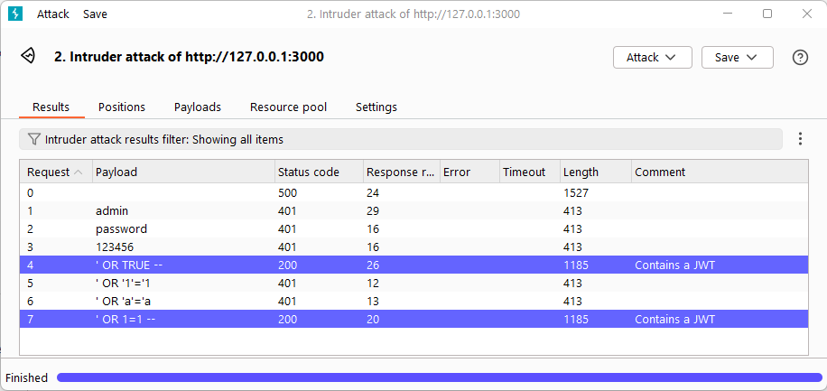

# Uge 44 - Authorization, Injection & Mass assignment

**Reflektionspunkter efter forberedelsen og inden undervisningen:**

- Hvad er årsagen til at mass assignment er muligt?
  >Manglende inputvalidering.
- Hvad skal valideres for at undgå mass assignment?
  >Brugerinputs.
- Hvad er et sql injection angreb?
  >En sårbarhed gør det muligt for en angriber at kommunikerer med applikationens bagvedliggende SQL database.
- Hvad er Meta karakterer?
  >Karakterer som SQL behandler som funktioner i stedet for data.
- Hvad er et cross-site scripting angreb? (XSS)
  >Når en angriber har mulighed for at afvikle scripts gennem en brugerinputs. Fx JavaScript eller HTML.
- Hvad er et command inject angreb?
  >Når en angriber har mulighed for at sende terminal kommandoer til det bagvedliggende styresystem.
- Hvad er en BOLA sårbarhed?
  >En BOLA-sårbarhed (Broken Object Level Authorization) er en type sikkerhedsrisiko, der opstår, når et system ikke korrekt håndhæver adgangskontrol på objektniveau. Fx, hvis en bruger kan ændre en URL eller en parameter i en API-anmodning for at få adgang til en anden brugers data, uden at systemet tjekker, om brugeren har de nødvendige rettigheder, er det en BOLA-sårbarhed.
- Hvad er en BFLA sårbarhed?
  >En BFLA-sårbarhed (Broken Function Level Authorization) opstår, når et system ikke korrekt håndhæver adgangskontrol på funktionsniveau. Fx, hvis en bruger kan ændre en parameter i en API-anmodning for at udføre en handling, som de ikke har tilladelse til, uden at systemet tjekker, om brugeren har de nødvendige rettigheder, er det en BFLA-sårbarhed
- Hvad er A-B Testing for BOLA?
  >At oprette ressourcer med en bruger (a), og derefter forsøge at tilgå dem med en anden bruger (b).
- Hvad er A-B-A Testing for BFLA?
  >Som A-B testing, men med den tilføjelse at bruger A, kontrollerer at ændringer udført af bruger B er gennemført.

---

## [Opgave 16 - Injection, Mass assignment & BFLA](https://24e-its-web-sikkerhed-ucl-pba-its-bd36043c2948d5aa4536abdfad07f.gitlab.io/exercises/15_bflaMassAssignmentInjection/)

**Information**
I disse opgaverne skal arbejde med flere forskellige emner. Alle opgaver bygger videre på tidligere lærte færdigheder.

Opgaverne er beskrevet i Hacker lab repoet, og delt op i 2 sæt. Det 1. sæt er grundlæggende angreb mod crAPI, der fungerer som introducerende øvelser, og det 2. sæt er grundlæggende angreb mod Juiceshop som er repetation samt udvidelse af færdighederne anvendt i det 1. sæt

**Instruktioner**

### crAPI øvelser
**Basic Injection attack**
Injection attacks are attacks where malicious actors injects malicious data into software, to make the software behave in a unintended way, allowing for malious operations on the software.

There are multiple categories of injection attacks, such as SQL injection, code injection, Command injection etc. There are many categories.

The purpose of these exercise, is to give an basic introduction to Injection attacks.

The 2 first exercise are NoSQl and SQL Injection attacks, Exploiting the vulnerabilities discovered in the previous Fuzzing input exercise.


#### **Basic NoSql Injection attack**
In the previous fuzzing exercise, it was discoverd that the statement { "$ne": null} triggered a particularly interesting response, we will try to exploit this with at NoSql injection attack.

Perform the following actions:

1. In the crAPI website, attempt to validate a coupon and capture the request.

2. Alter the request, so the coupon code is { "$ne": 1 }

3. Read and verify the response. Note the coupon as you need it for the next exercise.
>TRAC75

4. NoSql is not a syntax we cover in this course, but if you are interested, you can read about Mongodb here, which is a NoSql database. They are very different from relational database, but one of the major difference is that they do not use SQL as query syntax.

#### **Basic SQL injection attack - Get database version**
In this exercise we will attempt to perform a SQL injection attack, to obtain the version of the used relational database.

1. In the crAPI, redeem the coupon obtained in previous exercise, and capture the apply coupon request.
2. Alter the request so the coupon code is 0'; select version() --+
3. Review the reply, and google which type of database the specified database is.
>PostgreSQL 14.13

It is not uncommon for web applications to use multiple types of database, e.g. relational and NoSql database. Obisvisouly these vulnerabilities are easy to exploit, when you know they exist, but finding these rather simple vulnerabilities without any prior knowledge would be rather hard. Then it is better to review the code of the application, to determine if proper input validation is used, Objects upholds invariance, or either parameterized statements or ORM are used. All of the before mentioned could mitigate this attack, and in combination with each other, create a strong safety net (Defense in depth).

#### **Basic Server side request forgery SSRF**
In this exercise you will attempt to get api to make a GET request to google, by altering the request input. The name of this attack is server side request forgery, but it still qualify as an injection attack, because it depends on what you send to the application.

Not so many clues in this exercise, so it requires a bit of tinkering, but once you find the solution, you will discover that it is quiet simple.

Capture the post request for contact mechanic
find a way to use the post request making the server calls https://www.google.dk
This type of exploit can be avoided by keeping a request allow list in the application, ensure that the application can only make request to a selected set of URL's.

#### **Basic mass assignment attack**
Mass assignment attacks happens when user are allowed to input values they where not intended to input, and therefore can control values in the application.

The mitigation for this attack is proper input validation, and not directly using dto's in the code. A DTO have a single purpose, which is to represent the data that is being transferred. Once the data is received, the values of the dto should be used to initialize an object that uphold invariance. This acts as a decouple, and ensure that data is not accidentally received or dispatched(creating excessive data exposure) from the application.

*Changing the status of an order.*

1. In the crAPI website create an order (E.g. buy a wheel)
2. Go to the past order menu.
3. click order details on a order and capture the request.
4. Send the captured request and inspect the Allow header in the response, which http methods are allowed?
>GET, POST, PUT, HEAD, OPTIONS
5. In the response body notice the status value.
>"delivered"
6. Change the request method to PUT, and set the content body of the request to:
```
{
    "status":"returned"
}
```
7. Send the request, and notice the status of the order.
>"returned"
Besides being a mass assigment vulnerability. This is also BFLA and generally a broken access control vulnerability,because a customer can change the state of an order.

### Juiceshop øvelser

**Basic injection attacks.**

#### Basic SQL injection attack 
In the [Fuzzing input exercise](7_Fuzzing_input.md) you discovered that the user name value is vulnerable to SQL injection attacks.
In this exercise you will exploit that.

Perform the following actions:

1. In the juiceshop web application, authenticate with `'` as username, and the password `123` and capture the response.

2. Inspect the response (Should be error code 500). What type of error is it?
>SQLITE_ERROR

3. Locate the sql string in the response, and copy it to notepad.
```sql
"SELECT * FROM Users WHERE email = ''' AND password = '202cb962ac59075b964b07152d234b70' AND deletedAt IS NULL"
```

4. In the sql string you copied to notepad, replace the value of email with `' OR TRUE --`, what does this sql string do?
```sql
"SELECT * FROM Users WHERE email = ' OR TRUE -- AND password = '202cb962ac59075b964b07152d234b70' AND deletedAt IS NULL"
```
**email = ’ OR TRUE –**: Dette er den kritiske del af injectionen. email = ' afsluttes med en enkelt anførselstegn, og OR TRUE gør, at betingelsen altid evalueres som sand. -- er en kommentar i SQL, hvilket betyder, at resten af forespørgslen ignoreres.

Resultatet er, at forespørgslen bliver til:
```sql
SELECT * FROM Users WHERE email = '' OR TRUE
```

Because the application made a printout of the SQL string, it is now very easy to experiment with manipulation of the string.
Therefor such information should not be exposed. Stack traces and error messages are attack vectors.

* In the juice shop web site, authenticate your self with the username `' OR TRUE --` and the password `123`.
* Go to account information, which user are you authenticated as?
>admin@juice-sh.op

SQL injection attacks can be mitigated in numerous ways. Either use [Parameterized queries](https://learn.microsoft.com/en-us/aspnet/web-forms/overview/data-access/accessing-the-database-directly-from-an-aspnet-page/using-parameterized-queries-with-the-sqldatasource-cs),
or  [ORM (.Net har Entity framework)](https://learn.microsoft.com/en-us/ef/core/). Furthermore, input validation and upholding objects invariance help mitigate SQL (Or noSql) attacks.

#### Perform the sql injection attack with fuzzing
The purpose of this exercise is to perform a repetive exercise of the fuzzing technique.

1. create a small wordlist with a known SQL injection string, including the `' OR TRUE --`.
2. Obtain a response 200 code with a fuzzing attack (Using Burp suite or WFuzz).




<!-- #### Basic DOM Cross site scripting
DOM XSS is an injection attack on the browser (Client side) where you try to execute malicious scripts in the browser by injecting javascript code. So initially the backend server(s) or database is not affected by this attack. The main goal of this types of attacks is to steal data from the user of the browser. E.g. Credentials. 

1. in the search bar, input the string `hey` and view the result.
>"No reuslts found"
2. in the search bar, input the string ```<h6>hey</h6>``` and view the result

The result shows that the font size in the search result have changed, which means that  
the input is not [HTML encoded](https://www.w3schools.com/html/html_charset.asp) and the
browser therefor have accepted the input string as valid HTML. To prove this do the following:

1. In the search bar, input the string ```&#60;h6&#62;hey&#60;/h6&#62```
2. Review the result, which should be ```<h6>hey</h6>```.

Knowing that the application is vulnerable to XSS, lets try to inject a simple script into
the search field.

1. In the search bar, input the string `<script>alert('You got hacked')</script>`

The result shows up blank. This indicates that inline scripts are disables for this
website(Or the browser disallows it). So we will have to try to inject a script, without using an inline script
tag. Some tags such as `iframe` allows its attributes to be executable scripts, which 
can circumvent disallowed inline scripts. Let try to do that.

1. In the search bar, input the string `<iframe src="javascript:alert('you got hacked')">`.

The [IFrame tag](https://developer.mozilla.org/en-US/docs/Web/HTML/Element/iframe) is a way to embed other
html pages into the current one. The embedded HTML page can be generated or requested through Javascript as a 
convenience, but unfortunately it can also be abused. The `IFrame` tag is not the only tag which allows attributes
to execute Javascript. You could try with ``.
The mitigation for this, is of course to ensure that the client side(browser) encodes all received input.

This attack is not the most useful. But if you can perform what is known as a stored XSS attack, which
means you get the server to persist your Javascript injection as data, and deliver it to other users,
this can be very useful. -->

#### Basic mass assignment attack

**Obtain admin role**
In this exercise you will use mass assignment to perform an Escalation of privilege with a user account.

First you must:

- Capture a sign up request
- Review the response in this request, and determine what attribute shows the users role
>"role":"customer",
- Create a new request sign up request, with an extra parameter that sets the role as admin.
>```json
>{"email":"ebruger@test.com","password":"**********","passwordRepeat":"**********",
>"role":"admin",}
>```

Once you have done that. sign in to the juice page, and confirm that you can enter the admin page at the url: http:localhost:3000/#/administration

<!-- #### Basic BFLAS 

**Exploring the API**
During the api enumeration, the URL http://localhost:3000/api/Products was discovered. You should explorer this URL from POSTMAN.  
How does it react to the methods GET, POST and PUT?
>GET = 200 Ok
>POST = 401 Unauthorized
>PUT = 500 Internal Server Error

Can you perform any action you where not intended to, such as adding or editing resources?
One method call might give you some information about the structure of the requests.

**Add product**
From postman you should be able to add a product, if you use the right HTTP Method. You might also need some authorization. But remember BFLA's is about user being able to execute functions on the api, which they where never intended to.  
Remember to use the right Content-Type header for the data format.

**Update a product**
Using the right method, you might be able to update a product.  
If you are able to change it, can you test the applications lexical input validation?  
And how about the semantics, can you change price to something that does not make sense, like negativ values?  

_Hint: Resource locators are often placed in the URL_ -->