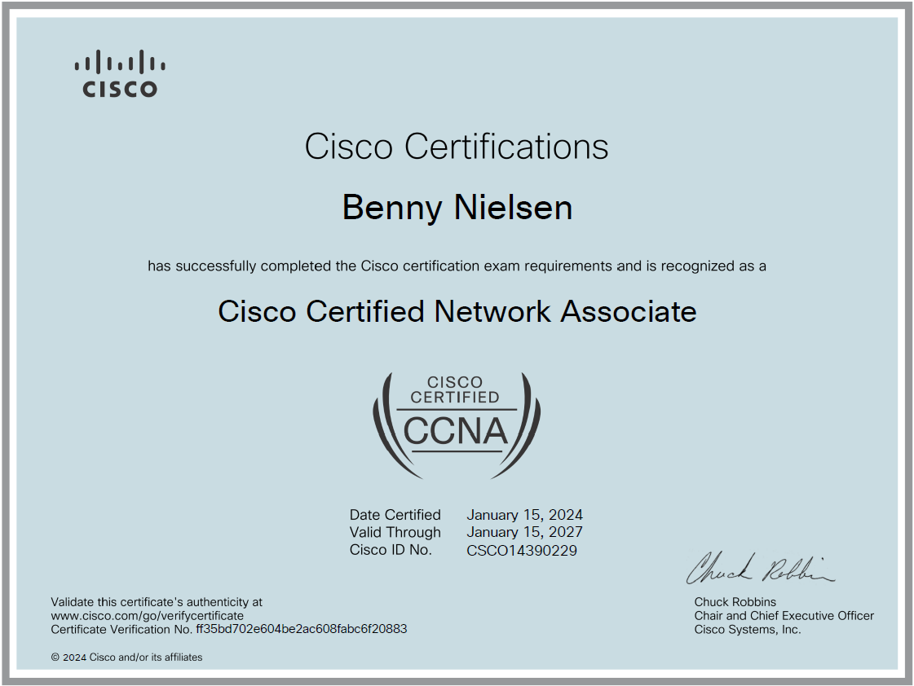

# Benny Nielsen

{ align=right }

Jeg er en erfaren og teknisk stærk projektleder, som er i gang med et karriereskifte ind i IT-verdenen. Jeg går på 2. semester på uddannelsen PBA i IT-Sikkerhed, og mit mål er at skabe en karriere inden for Governance & Compliance, eller at arbejde med sikkerhed i netværk og infrastruktur.

## Erhvervserfaring
**2013-2022: Projektleder, Lightcare A/S.**

* Projektledelse fra tilbud til brugeroverdragelse af døgnrytmebelysning
* Projektering, indkøb, konfigurering og opsætning af netværksudstyr til lysstyring
* Produktudvikling og fejlfinding på hardware og software
* Programmering af lysstyring til døgnrytmebelysning
* Leverandørsamarbejde og indkøbsansvarlig
* Koordinering af virksomhedens opgaver
* Brugerundervisning og udarbejdelse af manualer og træningsvideoer
* Kunderservice og remote support via fjernskrivebord
* Lysberegning og tegningsdokumentation (DIALux og AutoCAD)

**2010-2013: Intern salg og projektmedarbejder, Luminex A/S.**

* Projektering og tilbudsoprettelse af belysningsanlæg
* Kundeservice og rådgivning
* Intern kommunikation som datablade, how-tos og FAT-test

**2008-2010: Salgsassistent, Silvan Odense (Studiejob)**

* Rådgivning og kundeservice i El afdelingen

**2004-2008: Elektriker, Asperup El**

* Elektriker, lærling og efterfølgende montør
* IHC Programmering
* Netværksinstallationer
* Almindelige serviceopgaver

---
## Uddannelse

* 2024 - 2026: PBA i IT-Sikkerhed (igangværende)
* 2022 - 2024: IT Teknolog
* 2008 - 2010: El Installatør
* 2004 - 2008: Elektriker, Lys og Energi
---

## Kurser og Certificeringer

* Januar 2024: Cisco Certified Network Associate (CCNA)
* Oktober 2022: Google IT Support Professional

## LinkedIn
[LinkedIn :simple-linkedin:](https://www.linkedin.com/in/benny-nielsen-1089b02b/){ .md-button }

[Se også min TryHackMe profil :simple-tryhackme:](https://tryhackme.com/p/Benny.Nielsen){ .md-button .md-button--primary }